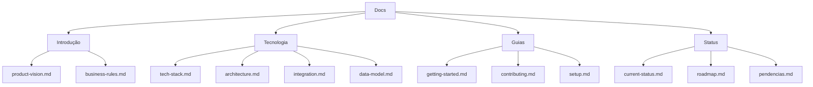

# Troca-Aula - Documentação

Bem-vindo à documentação do projeto Troca-Aula. Aqui você encontrará todas as informações necessárias para entender, desenvolver e contribuir com o projeto.

## Estrutura da Documentação



## Navegação Rápida

### Para Novos Membros

1. **[Visão do Produto](./intro/product-vision.md)** - Entenda o que é o Troca-Aula
2. **[Stack Tecnológica](./tech/tech-stack.md)** - Tecnologias utilizadas
3. **[Getting Started](./guides/getting-started.md)** - Primeiros passos
4. **[Como Contribuir](./guides/contributing.md)** - Guia de contribuição

### Para Desenvolvedores

1. **[Arquitetura](./tech/architecture.md)** - Diagramas e estrutura
2. **[Stack](./tech/tech-stack.md)** - Detalhes técnicos
3. **[Integração Frontend-Backend](./tech/integration.md)** - Comunicação entre camadas
4. **[Estado Atual](./status/current-status.md)** - O que está pronto
5. **[Roadmap](./status/roadmap.md)** - Próximas tarefas

### Para Gestores

1. **[Visão do Produto](./intro/product-vision.md)** - Objetivos e métricas
2. **[Estado Atual](./status/current-status.md)** - Status do projeto
3. **[Roadmap](./status/roadmap.md)** - Plano de evolução

## Arquitetura do Sistema

```mermaid
graph TB
    subgraphFrontend[Frontend]
        F1[Next.js 15]
    end
    
    subgraphBackend[Backend]
        B1[NestJS API]
        B2[Prisma ORM]
        B3[PostgreSQL]
    end
    
    subgraphExternal[Externos]
        E1[Gov.br API]
    end
    
    F1 -->|HTTP| B1
    B1 --> B2
    B2 --> B3
    B1 -.->|OAuth2| E1
```

## Repositórios

| Repositório | Descrição |
|-------------|-----------|
| [troca-aula-front](https://github.com/TROCA-AULA/troca-aula-front) | Frontend (Next.js 15) |
| [troca-aula-backend](https://github.com/TROCA-AULA/troca-aula-backend) | Backend (NestJS) |

## Links Úteis

- **Video de Apresentação**: [YouTube](https://www.youtube.com/watch?v=xWZov3HvWgw)
- **Constituição do Projeto**: [.specify/memory/constitution.md](../.specify/memory/constitution.md)

## Quick Links

| Tópico | Arquivo |
|--------|---------|
| O que é o projeto | [product-vision.md](./intro/product-vision.md) |
| Regras de negócio | [business-rules.md](./intro/business-rules.md) |
| Stack completa | [tech-stack.md](./tech/tech-stack.md) |
| Arquitetura com diagramas | [architecture.md](./tech/architecture.md) |
| Modelo de dados | [data-model.md](./tech/data-model.md) |
| Integração Frontend-Backend | [integration.md](./tech/integration.md) |
| Como começar | [getting-started.md](./guides/getting-started.md) |
| Setup e configuração | [setup.md](./guides/setup.md) |
| Onde estamos | [current-status.md](./status/current-status.md) |
| Próximos passos | [roadmap.md](./status/roadmap.md) |
| **Pendências do Frontend** | [pendencias.md](./status/pendencias.md) |
| **Prompts de Implementação** | [prompts-pendencias.md](./prompts-pendencias.md) |

---

**Última atualização**: 2026-05-16  
**Versão do projeto**: 0.1.0  
**Stack**: Next.js 15 + React 19 + NestJS + PostgreSQL