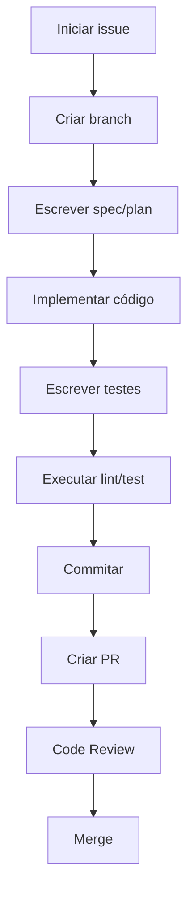

# Guia de Contribuição

## Boas Práticas de Desenvolvimento

### Princípios Fundamentais

1. **Acessibilidade em Primeiro Lugar**
   - Sempre considere acessibilidade WCAG 2.1
   - Use labels claros para inputs
   - Garanta navegação por teclado

2. **Arquitetura Modular**
   - Separe responsabilidades: Service, Hook, View
   - Um arquivo = uma responsabilidade

3. **Testes Primeiro (TDD)**
   - Escreva o teste antes da implementação
   - Ciclo: Red → Green → Refactor

4. **Simplicidade**
   - "Simples bem feito é melhor que complexo perfeito"
   - Evite over-engineering

## Estrutura de Commits

### Conventional Commits

```
<tipo>(escopo): descrição

[corpo opcional]

[footer opcional]
```

### Tipos de Commit

| Tipo | Descrição |
|------|-----------|
| `feat` | Nova funcionalidade |
| `fix` | Correção de bug |
| `docs` | Documentação |
| `style` | Estilização (CSS) |
| `refactor` | Refatoração |
| `test` | Testes |
| `chore` | Tarefas de manutenção |

### Exemplos

```bash
git commit -m "feat: adiciona компонент de validação de form"
git commit -m "fix: corrige problema de rota no logout"
git commit -m "docs: adiciona diagrama de arquitetura"
git commit -m "refactor: separa lógica de API em service"
git commit -m "test: adiciona testes para useUserHook"
```

## Padrões de Código

### Componentes React

```tsx
// ✅ Bom: Componente em arquivo separado
// Logo.tsx
import styled from 'styled-components';

const LogoContainer = styled.div`
  /* estilos */
`;

export default function Logo({ size = 100 }) {
  return <LogoContainer>...</LogoContainer>;
}

// ❌ Ruim: Componente com tudo no mesmo arquivo
// sem separação de responsabilidades
```

### Hooks Personalizados

```tsx
// ✅ Bom: Hook com nome claro e responsabilidade única
// useUserHook.tsx
export function useUserHook() {
  const [user, setUser] = useState(null);
  
  const fetchUser = async () => { ... };
  
  return { user, fetchUser };
}
```

### Services de API

```tsx
// ✅ Bom: Service separado
// api.service.tsx
import axios from 'axios';

const api = axios.create({
  baseURL: process.env.NEXT_PUBLIC_API_URL
});

api.interceptors.response.use(
  (success) => success,
  (error) => {
    toast.error(error.response.data.message);
    throw error;
  }
);

export default api;
```

## Fluxo de Trabalho

### Criando uma Nova Feature



### Nome da Branch

Formato: `<issue>-<descricao>`

```bash
# Exemplo
git checkout -b 001-login-govbr
git checkout -b 002-dashboard-admin
git checkout -b fix-003-correcao-logout
```

## Checklist Antes do PR

- [ ] Código segue padrões de nomenclatura
- [ ] Testes passando
- [ ] ESLint não mostra erros
- [ ] Commits seguem Conventional Commits
- [ ] Documentação atualizada (se necessário)
- [ ] Diagramas Mermaid atualizados (se aplicável)

## Revisando Código

### Pontos a Verificar

1. **Funcionalidade**: O código faz o que deveria?
2. **Testes**: Tem testes para a nova funcionalidade?
3. **Acessibilidade**: Segue padrões WCAG?
4. **Performance**: Há algum problema de performance?
5. **Segurança**: Não expõe dados sensíveis?
6. **Manutenibilidade**: Código é fácil de manter?

### Feedback Construtivo

- Seja específico e objetivo
- Sugira melhorias, não apenas critique
- Reconheça boas práticas
- Questione decisões quando necessário

## Perguntas Frequentes

### Como adicionar uma nova página?

1. Criar pasta em `src/app/`
2. Criar `page.tsx` com o componente
3. Adicionar rota no menu (se necessário)

### Como adicionar um novo endpoint?

1. Criar rota em `src/app/api/`
2. Implementar lógica no arquivo de rota
3. Testar a integração

### Como rodar apenas um teste?

```bash
pnpm test -- caminho/do/teste
```

### Como verificar a cobertura de testes?

```bash
pnpm test:coverage
```

## Recursos Adicionais

- [Constitution do Projeto](./../intro/constitution.md)
- [Stack Tecnológica](./tech/tech-stack.md)
- [Arquitetura](./tech/architecture.md)
- [Estado Atual](./status/current-status.md)