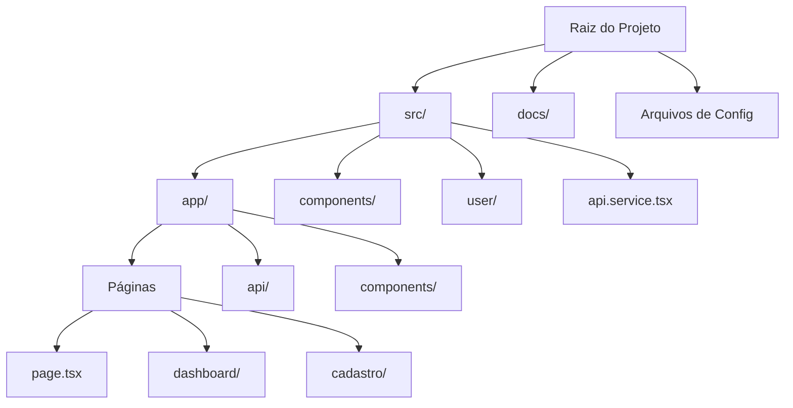
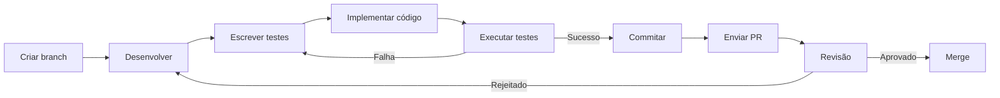

# Getting Started - Como Começar

## Pré-requisitos

Antes de começar, certifique-se de ter instalado:

| Requisito | Versão | Comando de Verificação |
|-----------|--------|----------------------|
| Node.js | 22.x | `node --version` |
| pnpm | 10.x | `pnpm --version` |
| Git | Latest | `git --version` |

### Configuração do Node com nvm

```bash
# Instalar nvm (se não tiver)
curl -o- https://raw.githubusercontent.com/nvm-sh/nvm/v0.39.0/install.sh | bash

# Usar Node 22
nvm use 22

# Definir como padrão
nvm alias default 22
```

## Instalação

### 1. Clonar o Repositório

```bash
git clone https://github.com/TROCA-AULA/troca-aula-front.git
cd troca-aula-front
```

### 2. Instalar Dependências

```bash
# Usando pnpm (recomendado)
pnpm install

# Ou usando npm
npm install
```

### 3. Configurar Variáveis de Ambiente

Crie um arquivo `.env.local` na raiz do projeto:

```env
NEXT_PUBLIC_API_URL=http://localhost:5000
```

### 4. Executar o Servidor de Desenvolvimento

```bash
# Com pnpm
pnpm dev

# Com npm
npm run dev

# Com yarn
yarn dev
```

O servidor estará disponível em: **http://localhost:3000**

## Scripts Disponíveis

| Script | Descrição |
|--------|-----------|
| `pnpm dev` | Inicia servidor de desenvolvimento |
| `pnpm build` | Faz build de produção |
| `pnpm start` | Inicia servidor de produção |
| `pnpm lint` | Executa ESLint |
| `pnpm test` | Executa testes |
| `pnpm test:watch` | Executa testes em modo watch |
| `pnpm test:coverage` | Gera relatório de cobertura |

## Estrutura de Arquivos do Projeto



## Fluxo de Desenvolvimento



## Primeiros Passos para Contribuidores

### 1. Criar Branch de Feature

```bash
git checkout -b 001-minha-feature
```

### 2. Fazer Alterações

Siga as convenções do projeto:
- Componentes em PascalCase
- Hooks com prefixo `use`
- Services separando lógica de API

### 3. Commitar com Conventional Commits

```bash
# Exemplos
git commit -m "feat: adiciona componente de login"
git commit -m "fix: corrige validação de email"
git commit -m "docs: atualiza README"
```

### 4. Executar Testes

```bash
# Todos os testes
pnpm test

# Com cobertura
pnpm test:coverage

# Modo watch
pnpm test:watch
```

### 5. Verificar Lint

```bash
pnpm lint
```

## Links Úteis

- [Documentação Next.js](https://nextjs.org/docs)
- [Documentação React](https://react.dev)
- [Styled Components](https://styled-components.com)
- [Vitest](https://vitest.dev)
- [Conventional Commits](https://www.conventionalcommits.org)

## Problemas Comuns

### Erro de dependências

```bash
# Limpar node_modules e reinstalar
rm -rf node_modules
pnpm install
```

### Porta em uso

```bash
# Mudar porta
pnpm dev -- -p 3001
```

### Erro de TypeScript

```bash
# Regenerar tipos
pnpm tsc --init
```