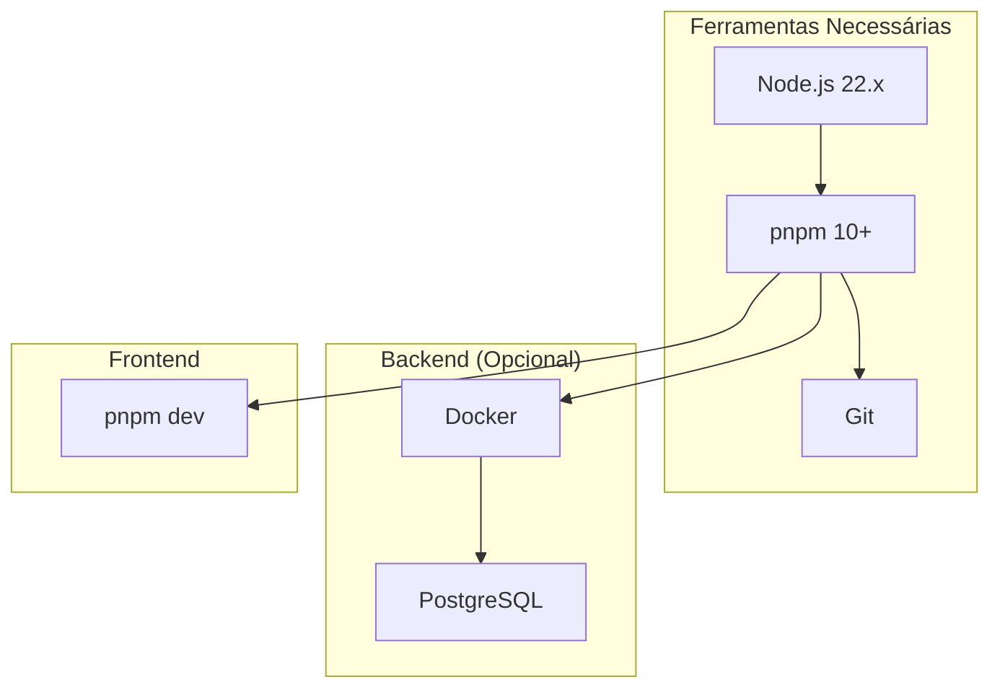
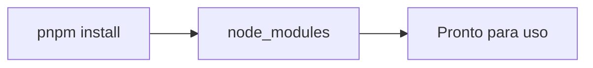
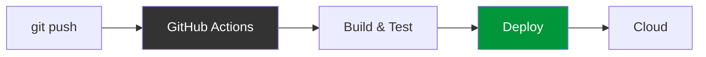

# Setup e Configuração

Este documento fornece instruções para configurar o ambiente de desenvolvimento do projeto Troca-Aula.

---

## Requisitos Prévios

### Software Necessário



### Verificação de Instalação

```bash
# Verificar Node.js (usando nvm)
nvm use 22
node --version
# Esperado: v22.x.x

# Verificar pnpm
pnpm --version
# Esperado: 10.x.x

# Verificar Git
git --version
# Esperado: qualquer versão recente
```

---

## Setup do Frontend

### 1. Clonar o Repositório

```bash
git clone https://github.com/TROCA-AULA/troca-aula-front.git
cd troca-aula-front
```

### 2. Instalar Dependências



```bash
# Instala todas as dependências
pnpm install
```

### 3. Configurar Variáveis de Ambiente

```bash
# Criar arquivo .env.local
cp .env.example .env.local
```

Editar `.env.local`:

```env
# URL do backend (local ou cloud)
NEXT_PUBLIC_API_URL=http://localhost:5000
```

### 4. Executar o Servidor de Desenvolvimento

```bash
# Inicia o servidor na porta 3000
pnpm dev

# Ou em outra porta
pnpm dev -- -p 3001
```

Acesse: **http://localhost:3000**

---

## Comandos Disponíveis

### Frontend

| Comando | Descrição |
|---------|-----------|
| `pnpm dev` | Inicia servidor de desenvolvimento |
| `pnpm build` | Faz build de produção |
| `pnpm start` | Inicia servidor de produção |
| `pnpm lint` | Executa ESLint |
| `pnpm test` | Executa testes |
| `pnpm test:watch` | Executa testes em modo watch |
| `pnpm test:coverage` | Gera relatório de cobertura |

### Build e Deploy



---

## Estrutura de Pastas

```
troca-aula-front/
├── src/
│   ├── app/                    # Next.js App Router
│   │   ├── page.tsx           # Login
│   │   ├── dashboard/         # Dashboard
│   │   ├── cadastro/          # Cadastro
│   │   └── api/               # API Routes
│   ├── components/            # Componentes externos
│   ├── user/                  # Hooks e tipos
│   └── api.service.tsx       # Serviço de API
├── docs/                      # Documentação
├── .specify/                  # Configuração Speckit
├── package.json
└── pnpm-lock.yaml
```

---

## Variáveis de Ambiente

| Variável | Descrição | Padrão |
|----------|-----------|--------|
| `NEXT_PUBLIC_API_URL` | URL do backend | `http://localhost:5000` |

---

## Troubleshooting

### Erro de dependências

```bash
# Limpar e reinstalar
rm -rf node_modules
rm pnpm-lock.yaml
pnpm install
```

### Porta em uso

```bash
# Verificar processo na porta 3000
lsof -i :3000

# Mudar porta
pnpm dev -- -p 3002
```

### Erro de TypeScript

```bash
# Regenerar tipos
pnpm tsc --init
```

---

## Backend (Configuração Opcional)

Para rodar o backend localmente, siga as instruções em: [troca-aula-backend](https://github.com/TROCA-AULA/troca-aula-backend)

### Configuração Docker

```yaml
# docker-compose.yml
version: '3.8'
services:
  postgres:
    image: postgres:14
    environment:
      POSTGRES_USER: user
      POSTGRES_PASSWORD: password
      POSTGRES_DB: troca_aula
    ports:
      - "5432:5432"
    volumes:
      - postgres_data:/var/lib/postgresql/data

volumes:
  postgres_data:
```

```bash
# Rodar PostgreSQL
docker-compose up -d
```