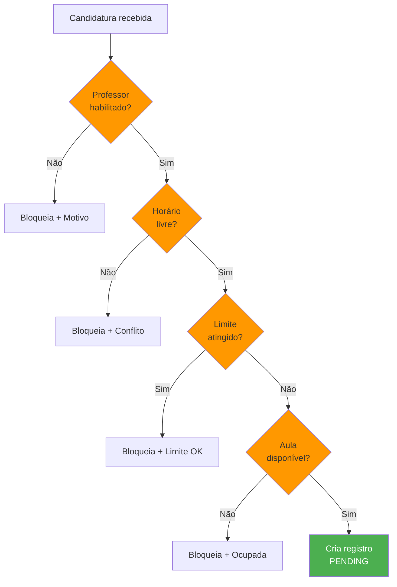
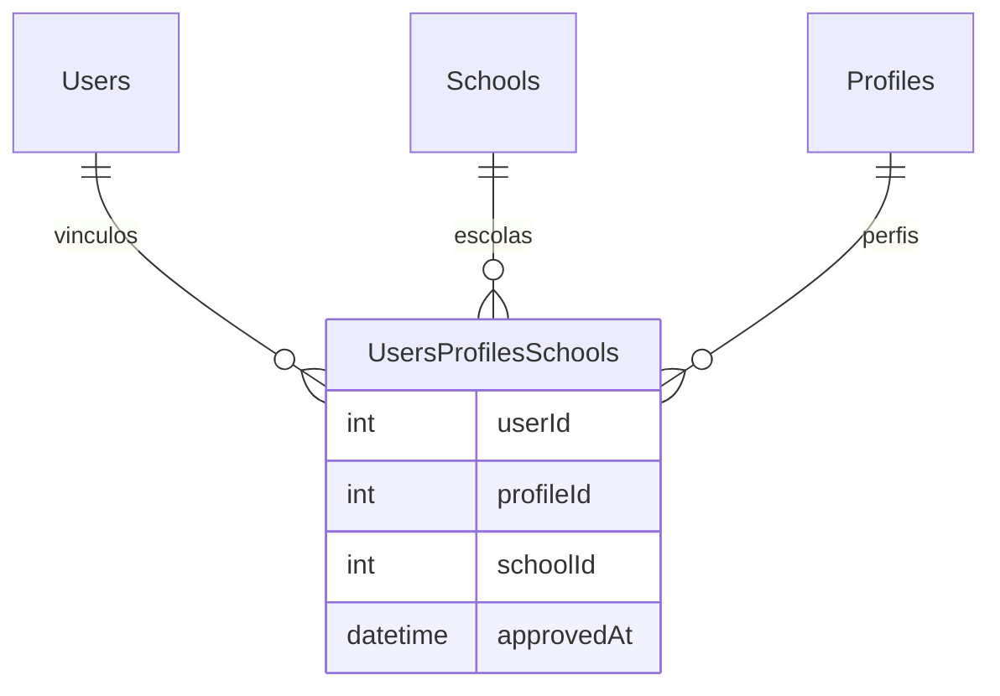

# Regras de Negócio

## Visão Geral

Este documento descreve as regras de negócio do sistema Troca Aula, definindo quem pode fazer o que e em quais condições.

---

## Regras de Autenticação

### R001 - Login de Usuário
- O usuário deve fornecer email e senha válidos
- A senha é comparada usando bcrypt
- Em caso de sucesso, retorna token JWT
- Em caso de erro, retorna 401 Unauthorized

### R002 - Token JWT
- Token tem validade de 24 horas
- Todas as rotas (exceto /auth/login) requerem token válido
- O token contém o ID do usuário no payload

---

## Regras de Classes (Aulas)

### R011 - Criar Aula

**Quem pode**: Apenas **DIRETOR** ou **AUXILIAR_ADMIN**

**Campos obrigatórios**:
- schoolId (escola)
- subjectId (disciplina)
- createdByd (criador)
- statededAt (início)
- finishedAt (término)

### R012 - Visualização de Aulas
- **Admin/Diretor**: Vê todas as aulas de todas as escolas
- **Professor**: Vê apenas aulas da sua escola

---

## Regras de Enrollment (Candidatura)

### R009 - Inscrever-se em Aula

**Quem pode**: Qualquer professor autenticado

**Validações**:
- Aula deve existir
- Aula não pode estar inscrita por outro professor
- Professor não pode estar inscrito duas vezes na mesma aula

### R010 - Cancelar Inscrição

**Quem pode**: Apenas o professor inscrito na aula

**Validações**:
- Aula deve ter inscrição ativa
- Apenas o inscrito pode cancelar

---

## Regras de Usuários

### R013 - Perfis de Usuário

| ID | Nome | Descrição |
|----|------|-----------|
| 1 | MASTER | Acesso completo ao sistema (gerencia escolas, diretores, admins, tudo) |
| 2 | DIRETOR | Governa uma escola específica (cria vagas, aprova candidaturas) |
| 3 | ADMIN | Opera as substituições de uma escola (cria vagas, gerencia operacional) |
| 4 | PROFESSOR | Se candida a aulas vagas e pode cancelar própria inscrição |

### R014 - Relação Usuário-Escola-Perfil

Um usuário pode ter múltiplos vínculos com diferentes escolas e perfis:

---

## Matriz de Permissões

| Ação | MASTER | DIRETOR | ADMIN | PROFESSOR |
|------|--------|---------|-------|------------|
| **Gestão do Sistema** |
| Criar/Editar/Excluir Escolas | ✅ | ❌ | ❌ | ❌ |
| Gerenciar Diretores | ✅ | ❌ | ❌ | ❌ |
| Gerenciar Administradores | ✅ | ❌ | ❌ | ❌ |
| Visualizar Todas as Escolas | ✅ | ❌ | ❌ | ❌ |
| Configurar Limites Globais | ✅ | ❌ | ❌ | ❌ |
| **Gestão de Escola** |
| Criar Aula Vaga | ❌ | ✅ | ✅ | ❌ |
| Editar Aula Vaga | ❌ | ✅ | ✅ | ❌ |
| Excluir Aula Vaga | ❌ | ✅ | ✅ | ❌ |
| **Candidaturas** |
| Inscrever-se em Aula | ❌ | ✅ | ✅ | ✅ |
| Cancelar própria Inscrição | ❌ | ✅ | ✅ | ✅ |
| Aprovar Candidatura | ❌ | ✅ | ✅ | ❌ |
| Rejeitar Candidatura | ❌ | ✅ | ✅ | ❌ |
| **Visualização** |
| Listar Aulas (todas) | ✅ | ✅ | ✅ | ❌ |
| Listar Aulas (escola) | ✅ | ✅ | ✅ | ✅ |
| Listar Escolas | ✅ | ✅ | ❌ | ❌ |
| Ver Histórico de Substituições | ✅ | ✅ | ✅ | ✅ |
| **Usuários** |
| Vincular Professor à Escola | ❌ | ✅ | ❌ | ❌ |
| Desvincular Professor | ❌ | ✅ | ❌ | ❌ |

> **Nota**: O MASTER pode executar qualquer ação no sistema. É o perfil com privilégios totais.

---

## Casos de Erro Comuns

| Código | Mensagem | Causa |
|--------|----------|-------|
| 400 | Conflito de horário detectado | Professor já tem aula no mesmo horário |
| 400 | Solicitação não está pendente | Status não é PENDING |
| 400 | Você já está inscrito nesta aula | enrolledById = userId |
| 403 | Apenas diretor ou admin pode criar | Perfil não autorizado |
| 403 | Você só pode aceitar aulas da sua matéria | subjectId diferente |
| 404 | Usuário não encontrado | ID inválido |
| 404 | Aula não encontrada | ID inválido |

---

## Definições de Negocio

### O Que É o Sistema

O Sistema Troca Aula é uma plataforma digital destinada a gerenciar o processo de substituição de professores em instituições de ensino. Seu objetivo principal é evitar que aulas fiquem vagas quando um professor precisa se ausentar, conectando de forma automatizada e organizada quem precisa de substituição com profissionais disponíveis.

### O Que Não É

- Não é um diário de classe eletrônico
- Não é um controle de frequência regular
- Não é uma rede social
- Não é um sistema de RH completo
- Não é um aplicativo de mensagens

### Funcionalidades Principais

1. **Criação de aulas vagas**: Professores ou agentes administrativos cadastram ausências
2. **Busca e candidatura**: Professores visualizam e se candidatam a vagas
3. **Controle de limite**: Sistema monitora o teto de substituições por professor
4. **Aprovação**: Diretores validam substituição
5. **Histórico**: Registro completo de todas as substituições