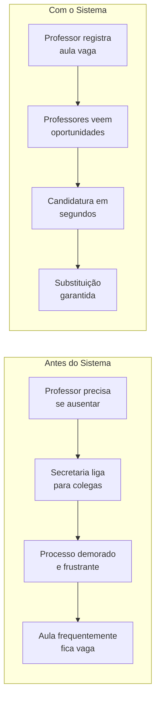
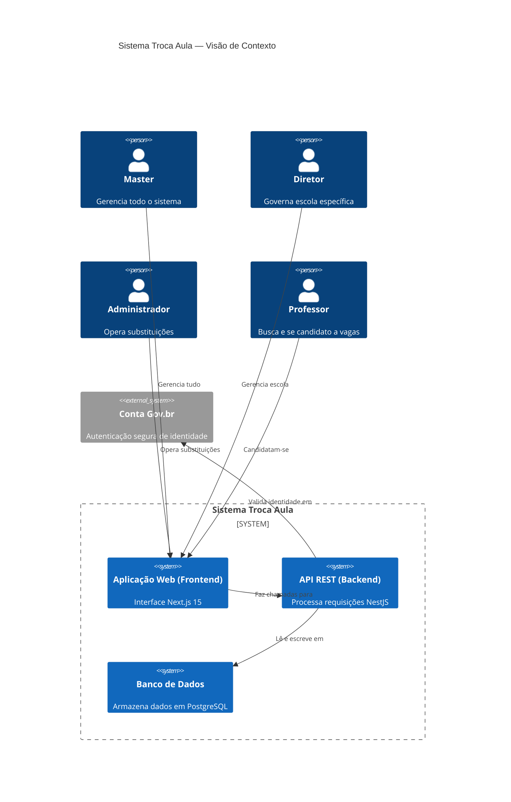

# Visão do Produto - Troca-Aula

## Propósito

O **Troca-Aula** é uma solução digital para facilitar a disponibilização de aulas vagas, ajudando as escolas a reduzir o índice de aulas vazias e garantir a continuidade pedagógica.

## Problema

O panorama educacional atual enfrenta desafios persistentes na gestão de ausências docentes. Sistemas tradicionais de substituição dependem de processos manuais como:
- Contatos telefônicos
- Planilhas físicas
- Tempo excessivo das secretarias escolares
- Interrupção recorrente do calendário letivo

### Impacto do Problema



## Personas do Sistema

O sistema foi desenvolvido para quatro perfis principais de usuários:

### 1. Master (Administrador Global)
- **Descrição**: Usuário com acesso completo ao sistema, pode gerenciar tudo
- **Acesso**: Portal administrativo completo
- **Necessidades**: 
  - Gerenciar escolas (criar, editar, excluir)
  - Gerenciar diretores e administradores de cada escola
  - Visualizar todas as aulas e substituições do sistema
  - Configurar limites globais de substituição
  - Dashboard administrativo com estatísticas
- **Observação**: Este perfil é criado manualmente após o sistema estar pronto

### 2. Diretor
- **Descrição**: Responsável pela governança de uma escola específica
- **Acesso**: Início da manhã e final do dia
- **Necessidades**: 
  - Criar aulas vagas para sua escola
  - Aprovar/rejeitar candidaturas de professores
  - Visualizar histórico de substituições da escola
  - Gerenciar professores vinculados à escola
  - Relatórios claros de substituições

### 3. Administrador
- **Descrição**: Profissional que coordena a parte operacional das substituições
- **Acesso**: Diário pelo computador na secretaria
- **Necessidades**: 
  - Criar e editar aulas vagas
  - Visualizar lista de aulas e candidatos
  - Cancelar aulas quando necessário
  - Verificar habilitação de candidatos

### 4. Professor
- **Descrição**: Profissional que busca oportunidades de aulas extras
- **Acesso**: Principalmente pelo celular
- **Necessidades**: 
  - Visualizar vagas disponíveis
  - Filtrar por disciplina, dia, horário
  - Candidatar-se a aulas vagas
  - Cancelar própria candidatura
  - Acompanhar histórico de substituições
  - Verificar limite de substituições restantes

## Oportunidade

Uma plataforma web escalável e acessível pode otimizar o processo de substituição de aulas, reduzindo a ocorrência de aulas vagas e aumentando a eficiência administrativa nas instituições de ensino.

## Objetivos

### Objetivo Geral
Projetar e evoluir uma plataforma digital dedicada à administração de substituições docentes, com o intuito de aperfeiçoar a alocação de profissionais e otimizar os fluxos operacionais em ambientes escolares por meio de automação e computação em nuvem.

### Objetivos Específicos

1. **Mitigação de lacunas pedagógicas**: Reduzir a incidência de aulas vagas para preservar a integridade do cronograma de ensino.

2. **Inclusividade e Acessibilidade**: Implementar padrões WCAG, garantindo suporte a leitores de tela, navegação por teclado e contrastes adequados.

3. **Modernização da Infraestrutura**: Transicionar para arquitetura em nuvem com CI/CD via GitHub Actions.

4. **Qualidade e Validação**: Garantir confiabilidade mediante testes automatizados com Jest.

5. **Segurança e Interoperabilidade**: Autenticação unificada via API Gov.br e documentação via Swagger.

6. **Gestão de Dados**: Otimizar persistência em PostgreSQL.

## Diferenciais

### Inclusão Digital
Padrões WCAG para garantir acesso a gestores e professores com deficiência.

### Automação
Fluxos automatizados de Candidatura → Aprovação → Registro.

### Integração Governamental
Autenticação via Conta Gov.br.

### Visão de Futuro
Proposta de integração com IoT para validação automatizada de presença em tempo real.

## Métricas de Sucesso

- Redução do tempo de preenchimento de aulas vagas
- Aumento da taxa de substituição preenchida
- Satisfação dos usuários (professores e administradores)
- Conformidade com padrões de acessibilidade WCAG 2.1

## Stack Tecnológica

| Componente | Tecnologia |
|------------|------------|
| Frontend | Next.js 15, React 18+ |
| Backend | NestJS (API REST) |
| Banco de Dados | PostgreSQL |
| Autenticação | Gov.br API |
| Cloud | Render/Railway |
| CI/CD | GitHub Actions |
| Testing | Jest + React Testing Library |

## Modelo de Negócio

O sistema opera como uma ferramenta de gestão escolar, não sendo:
- Rede social
- Diário de classe eletrônico
- Sistema de controle de frequência regular
- Sistema de lançamento de notas

Focado exclusivamente na gestão de substituições docentes.

## Glossário de Termos

| Termo | Definição |
|-------|-----------|
| **Aula Vaga** | Aula que ficou sem professor porque o titular precisa se ausentar |
| **Candidatura** | Ato de um professor se voluntariar para preencher uma aula vaga |
| **Teto de Substituições** | Número máximo de aulas que um professor pode substituir em um período |
| **Aprovação** | Ato do diretor validar e confirmar que uma substituição pode ocorrer |
| **Habilitação** | Condição de um professor estar qualificado para ensinar determinada disciplina |
| **Enrollment** | Registro de inscrição de um professor em uma aula vaga |

## Arquitetura do Sistema (C4)


```