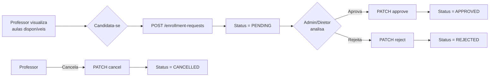
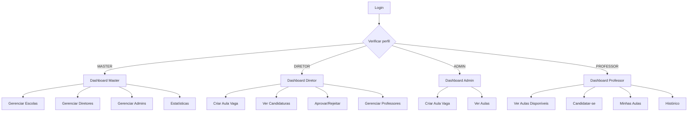

# Pendências do Frontend

## Visão Geral

Este documento lista as pendências, melhorias e correções necessárias no frontend do projeto Troca-Aula, baseadas nos contratos de API e nos perfis de usuário definidos (Master, Diretor, Administrador, Professor).

---

## Novos Perfis de Usuário

| ID | Perfil | Descrição |
|----|--------|-----------|
| 1 | MASTER | Acesso completo ao sistema |
| 2 | DIRETOR | Governa uma escola específica |
| 3 | ADMIN | Opera as substituições |
| 4 | PROFESSOR | Se candidata a aulas vagas |

---

## Funcionalidades Faltando

### 1. Área do Master (ADMINISTRAÇÃO GLOBAL) - ALTA 🔴

- **Status**: ❌ Não implementado
- **Descrição**: Precisa de uma área administrativa completa para o usuário Master gerenciar todo o sistema.
- **Funcionalidades necessárias**:
  - **Gestão de Escolas**: Criar, editar, excluir escolas
  - **Gestão de Diretores**: Criar, editar, desvincular diretores
  - **Gestão de Administradores**: Criar, editar, desvincular administradores
  - **Dashboard Global**: Estatísticas de todas as escolas
  - **Configurações Globais**: Definir limites padrão de substituições

**Endpoints necessários**:
- `GET /schools` - Listar todas as escolas
- `POST /schools` - Criar escola
- `PATCH /schools/:id` - Editar escola
- `DELETE /schools/:id` - Excluir escola
- `GET /users` - Listar usuários (com filtros por perfil)
- `POST /users` - Criar usuário (diretor/admin)
- `PATCH /users/:id` - Editar usuário

### 2. Sistema de Candidaturas (Enrollment Requests) - ALTA 🔴

- **Status**: ❌ Não implementado
- **Descrição**: O frontend atualmente usa `PATCH /classes/:id` para aceitar/aprovar aulas, mas deveria usar o fluxo correto de enrollment requests:
  - `POST /enrollment-requests` - Professor se candidatatar a uma aula
  - `PATCH /enrollment-requests/:id/approve` - Diretor/Admin aprova candidatura
  - `PATCH /enrollment-requests/:id/reject` - Diretor/Admin rejeita candidatura
  - `PATCH /enrollment-requests/:id/cancel` - Professor cancela candidatura

**Fluxo correto**:

### 3. Área do Diretor/Admin - ALTA 🔴

- **Status**: ⚠️ Parcial - Apenas funcionalidades básicas implementadas
- **Descrição**: Necesário expandir a área do Diretor/Admin para incluir:
  - **Gestão de Professores**: Vincular/desvincular professores da escola
  - **Visualização de Candidaturas**: Ver todas as candidaturas pendentes
  - **Aprovação/Rejeição Formal**: Usar endpoints de enrollment requests

**Funcionalidades a implementar**:
- Lista de candidaturas pendentes com detalhes do candidato
- Botões de aprovação/rejeição usando endpoints corretos
- Listar professores vinculados à escola

### 4. Controle de Limite de Substituições - ALTA 🔴

- **Status**: ❌ Não implementado
- **Descrição**: O frontend não exibe o limite de substituições nem trata erros.
- **API**: O backend retorna erro "Limite de substituições atingido para este semestre"
- **Melhorias necessárias**:
  - Exibir "X de Y substituições este semestre" no dashboard do professor
  - Tratar erro de limite com mensagem clara
  - Exibir alerta quando próximo do limite

### 5. Fluxo do Professor - MÉDIA 🟡

- **Status**: ⚠️ Parcial
- **Descrição**: O professor precisa ter as seguintes funcionalidades:
  - [x] Login/Cadastro
  - [x] Visualizar aulas disponíveis
  - [✅] Candidatar-se (implementado incorretamente via PATCH classes)
  - [❌] Cancelar própria candidatura (precisa implementar PATCH /enrollment-requests/:id/cancel)
  - [✅] Visualizar histórico

### 6. Login Gov.br - MÉDIA 🟡

- **Status**: ⚠️ Parcial - Componente criado, integração incompleta
- **Descrição**: O botão Gov.br existe mas não funciona completamente
- **API**: `POST /auth/login-govbr`

### 7. Seletor de Escola - ALTA 🔴

- **Status**: ❌ Hardcoded (schoolId = 1)
- **Descrição**: O formulário de criação de aula usa schoolId hardcoded
- **API**: `GET /schools` retorna lista de escolas
- **Melhoria**: Criar seletor de escola dinâmico baseado no perfil

### 8. Filtros de Busca - BAIXA 🟢

- **Status**: ⚠️ Parcial
- **Descrição**: Não usa filtros: `?available=true`, `?dayOfWeek`, `?subjectId`

---

## Endpoints Consumidos vs Disponíveis

### Consumidos Atualmente ✅

| Endpoint | Método | Status |
|----------|--------|--------|
| `/auth/login` | POST | ✅ OK |
| `/auth/logout` | POST | ✅ OK |
| `/auth/me` | GET | ✅ OK |
| `/classes` | GET | ✅ OK |
| `/classes` | POST | ✅ OK |
| `/classes/:id` | PATCH | ✅ OK (uso incorreto) |
| `/classes/:id` | DELETE | ✅ OK |
| `/schools/:id` | GET | ✅ OK (hardcoded) |
| `/subjects` | GET | ✅ OK |

### Não Consumidos (Necessários) ❌

| Endpoint | Método | Para |
|----------|--------|------|
| `/schools` | GET | Master, Diretor |
| `/schools` | POST | Master |
| `/schools/:id` | PATCH/DELETE | Master |
| `/users` | GET | Master, Diretor |
| `/users` | POST | Master, Diretor |
| `/users/:id` | PATCH/DELETE | Master |
| `/profiles` | GET | Todos |
| `/enrollment-requests` | GET | Todos |
| `/enrollment-requests` | POST | Professor |
| `/enrollment-requests/:id/approve` | PATCH | Diretor/Admin |
| `/enrollment-requests/:id/reject` | PATCH | Diretor/Admin |
| `/enrollment-requests/:id/cancel` | PATCH | Professor |

---

## Funcionalidades por Perfil

### Master (Perfil 1)

| Funcionalidade | Status | Prioridade |
|----------------|--------|------------|
| Dashboard Global | ❌ | Alta |
| CRUD Escolas | ❌ | Alta |
| CRUD Diretores | ❌ | Alta |
| CRUD Administradores | ❌ | Alta |
| Visualizar todas as escolas | ❌ | Alta |
| Configurar limites globais | ❌ | Média |

### Diretor (Perfil 2)

| Funcionalidade | Status | Prioridade |
|----------------|--------|------------|
| Criar Aula Vaga | ✅ | - |
| Listar Aulas da Escola | ✅ | - |
| Aprovar Candidatura | ⚠️ | Alta (usar endpoint correto) |
| Rejeitar Candidatura | ⚠️ | Alta (usar endpoint correto) |
| Vincular Professores | ❌ | Alta |
| Desvincular Professores | ❌ | Alta |
| Listar Professores da Escola | ❌ | Média |

### Administrador (Perfil 3)

| Funcionalidade | Status | Prioridade |
|----------------|--------|------------|
| Criar Aula Vaga | ✅ | - |
| Listar Aulas da Escola | ✅ | - |
| Editar Aula Vaga | ⚠️ | Parcial |
| Excluir Aula Vaga | ✅ | - |
| Visualizar Candidaturas | ❌ | Alta |

### Professor (Perfil 4)

| Funcionalidade | Status | Prioridade |
|----------------|--------|------------|
| Cadastro | ✅ | - |
| Login | ✅ | - |
| Visualizar Aulas Disponíveis | ✅ | - |
| Candidatar-se | ⚠️ | Alta (usar endpoint correto) |
| Cancelar própria candidatura | ❌ | Alta |
| Ver Histórico | ⚠️ | Parcial |
| Ver Limite de Substituições | ❌ | Alta |

---

## Fluxo de Navegação por Perfil

---

## Correções Necessárias

### 1. Nomenclatura de Campos

- **Problema**: Frontend usa `registredById` mas API usa `enrolledById`
- **Correção**: Padronizar para usar `enrolledById`

### 2. Response Format

- **Descrição**: API retorna `{ data, message, statusCode }` mas frontend não trata corretamente
- **Correção**: Extrair `.data` das respostas

### 3. Tipagem TypeScript

- **Descrição**: Muitos `@ts-ignore` no código
- **Correção**: Definir interfaces para todas as entidades

---

## Priorização de Tarefas

### Fase 1: Essencial (Alta Prioridade)

1. ✅ Sistema de login/cadastro (já existe)
2. 🔴 **Area do Master** - CRUD completo
3. 🔴 **Fluxo de Candidaturas** - Implementar enrollment requests
4. 🔴 **Seletor de Escola** - Dinâmico por perfil

### Fase 2: Importante (Média Prioridade)

5. 🟡 Login Gov.br - Finalizar
6. 🟡 Controle de Limite - Exibir e tratar erros
7. 🟡 Área do Diretor/Admin expandida

### Fase 3: Melhorias (Baixa Prioridade)

8. 🟢 Filtros de busca
9. 🟢 Loading states
10. 🟢 Error boundaries

---

**Última atualização**: 2026-05-16
**Próximo passo**: Implementar área do Master e corrigir fluxo de candidaturas