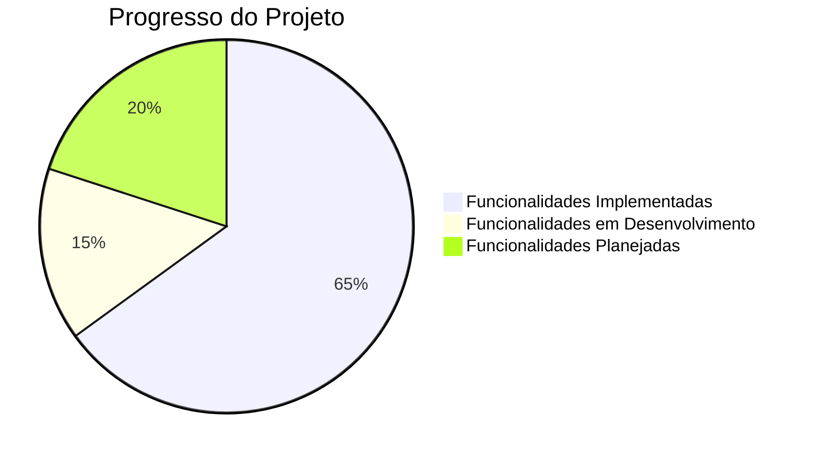
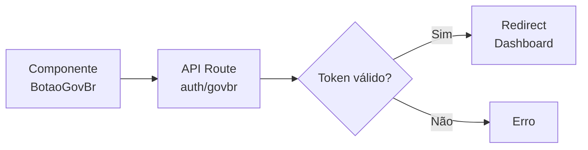
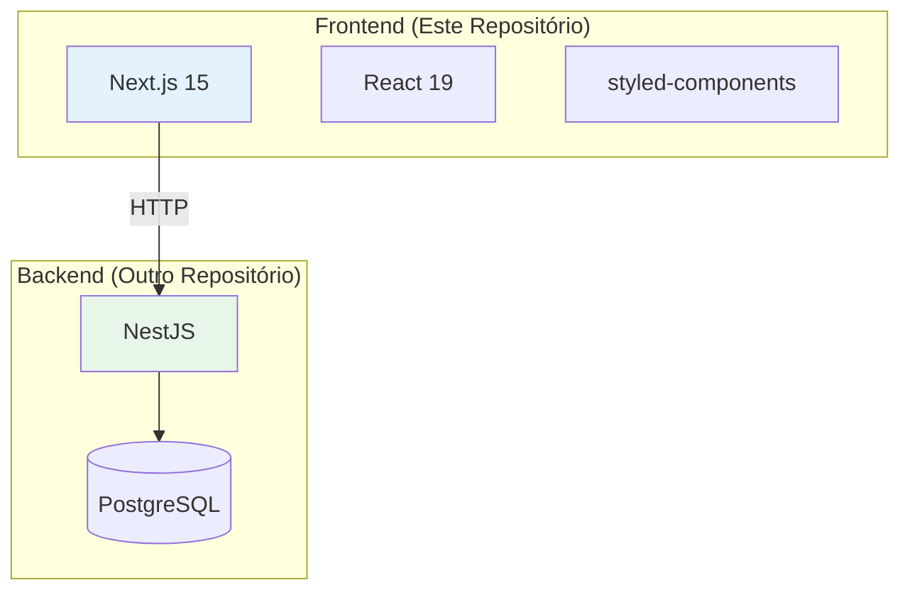
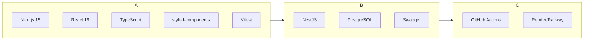

# Estado Atual do Projeto

## Visão Geral

## Funcionalidades Implementadas

### ✅ Autenticação

| Funcionalidade | Status | Descrição |
|----------------|--------|-----------|
| Login com email/senha | Completo | Autenticação com hash SHA1 |
| Cadastro de usuários | Completo | Formulário com validação Yup |
| Logout | Completo | Limpa sessão e redireciona |
| Sessão com cookies | Completo | JWT em cookies httpOnly |
| Middleware de proteção | Completo | Verifica autenticação nas rotas |
| Botão Gov.br | Parcial | Componente criado, integração pendente |

### ✅ Gestão de Aulas

| Funcionalidade | Status | Descrição |
|----------------|--------|-----------|
| Criar aula vaga | Completo | Formulário com disciplinas |
| Listar aulas disponíveis | Completo | Filtro por professor |
| Aceitar aula (professor) | Completo | Professor aceita substituição |
| Aprovar aula (admin) | Completo | Admin aprova substituição |
| Deletar aula | Completo | Remover aula vaga |
| Busca de aulas | Completo | Filtro por nome/disciplina |

### ✅ Interface

| Funcionalidade | Status | Descrição |
|----------------|--------|-----------|
| Página de login | Completo | Design responsivo |
| Página de cadastro | Completo | Validação de campos |
| Dashboard | Completo | Gestão de aulas |
| Logo customizado | Completo | Styled-components |
| Notificações toast | Completo | react-toastify |
| Tabulações | Completo | Aulas disponíveis/minhas |

## Funcionalidades em Desenvolvimento

### 🔄 Integração Gov.br

**Status**: Componente visual pronto, integração com API pendente.

### 🔄 Controle de Teto

- Sistema de controle de limite de substituições por professor
- Bloqueio quando atingir limite
- Alertas preventivos

## Funcionalidades Planejadas

### 📋 Backlog

| Funcionalidade | Prioridade | Descrição |
|----------------|------------|-----------|
| Relatórios | Alta | Dashboard com estatísticas |
| Notificações | Alta | Alertas de novas vagas |
| Perfil do professor | Média | Edição de dados profissionais |
| Histórico de substituições | Média | Lista de aulas anteriores |
| Integração IoT | Baixa | Validação de presença |

### 📋 Melhorias Técnicas

| Melhoria | Descrição |
|----------|-----------|
| Testes覆盖率 | Aumentar cobertura de testes |
| Component Library | Criar biblioteca de componentes |
| Theme Provider | Sistema de temas |
| Loading States | Skeletons e spinners |
| Error Boundaries | Tratamento de erros |

## Arquitetura Atual

## Métricas do Projeto

### Código

| Métrica | Valor |
|---------|-------|
| Arquivos fonte | ~15 arquivos |
| Componentes | 3 páginas + 2 componentes |
| Hooks | 1 (useUserHook) |
| Services | 1 (api.service) |
| Rotas API | ~6 endpoints |

### Testes

| Métrica | Status |
|---------|--------|
| Testes unitários | Parciais |
| Testes de integração | Parciais |
| Cobertura | ~30% |

##-stack Atual

## Dependências

### Principais

- next: 15.3.2
- react: 19.0.0
- styled-components: 6.1.18
- axios: 1.9.0
- vitest: 4.1.2

## Problemas Conhecidos

1. **Valores hardcoded**: School ID fixo em 1
2. **Validação de formulários**: Algumas validaações incompletas
3. **Tratamento de erros**: Precisa de padronização
4. **TypeScript**: Alguns `@ts-ignore` no código
5. **Component Library**: Não existe biblioteca de componentes reutilizáveis

## Próximos Passos Imediatos

1. Finalizar integração com Gov.br API
2. Implementar controle de teto de aulas
3. Adicionar testes para componentes críticos
4. Criar sistema de notificações
5. Melhorar tratamento de erros

## Links Úteis

- **Frontend**: https://github.com/TROCA-AULA/troca-aula-front
- **Backend**: https://github.com/TROCA-AULA/troca-aula-backend
- **Video Apresentação**: https://www.youtube.com/watch?v=xWZov3HvWgw