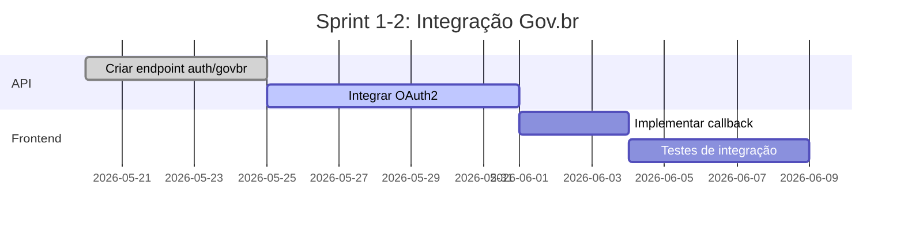
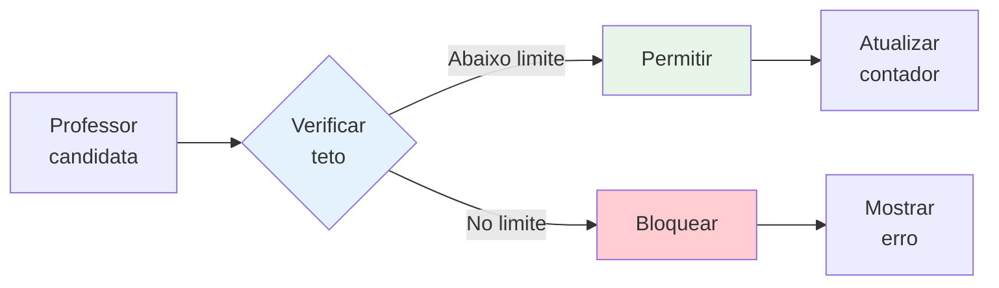
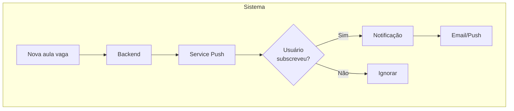
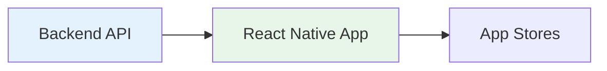
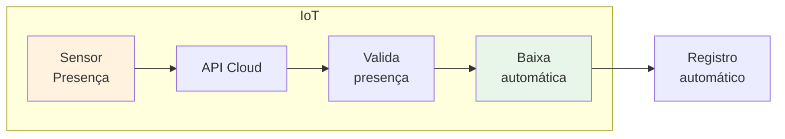
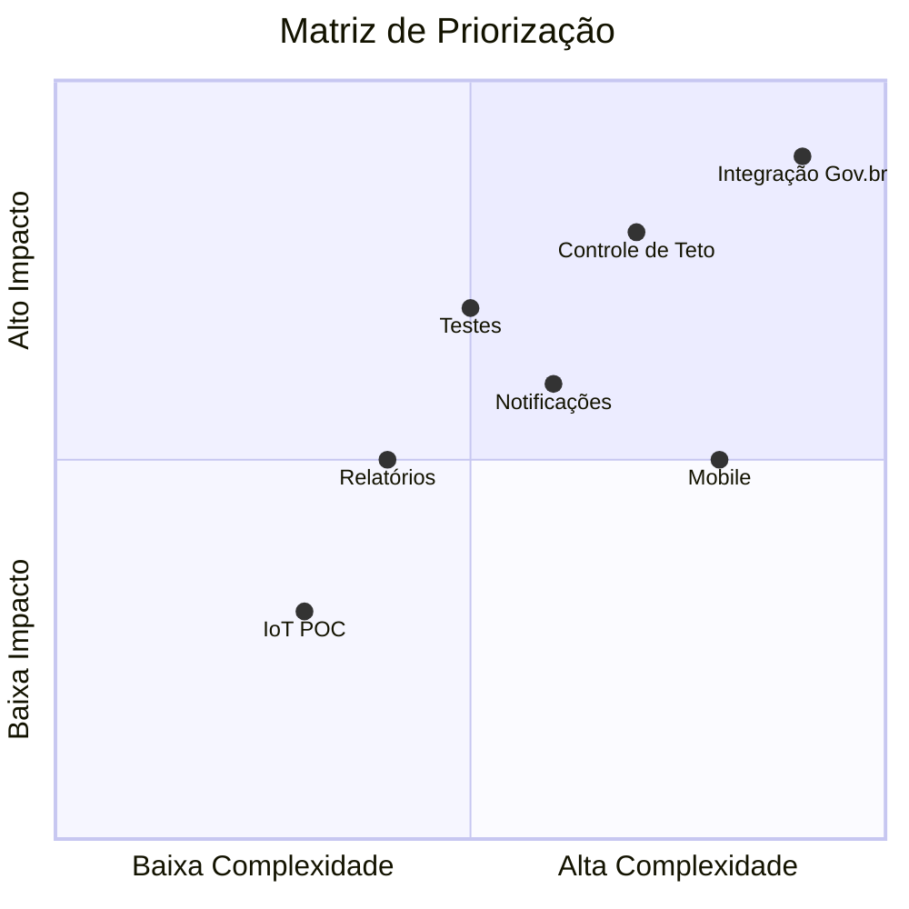

# Roadmap - Próximos Passos

## Visão de Curto Prazo (1-3 meses)

### Sprint 1-2: Finalizar Integração Gov.br

**Tarefas**:
- [ ] Configurar OAuth2/OpenID Connect
- [ ] Criar rota de callback
- [ ] Integrar botão Gov.br ao fluxo de login
- [ ] Testar integração completa
- [ ] Documentar configuração

### Sprint 3-4: Controle de Teto

**Tarefas**:
- [ ] Criar lógica de contagem de substituições
- [ ] Implementar limite configurável por escola
- [ ] Adicionar alertas quando próximo do limite
- [ ] Criar endpoint para consultar saldo
- [ ] Exibir saldo no dashboard do professor

## Visão de Médio Prazo (3-6 meses)

### Melhorias de UX/UI

**Tarefas**:
- [ ] Criar biblioteca de componentes
- [ ] Implementar Skeleton Loading
- [ ] Adicionar Error Boundaries
- [ ] Melhorar tratamento de erros
- [ ] Adicionar animações de transição

### Sistema de Notificações

**Tarefas**:
- [ ] Implementar WebSocket para tempo real
- [ ] Adicionar sistema de email
- [ ] Criar centro de notificações no UI
- [ ] Permitir filtros de notificação

### Expansão Mobile

**Tarefas**:
- [ ] Criar projeto React Native
- [ ] Implementar autenticação Gov.br
- [ ] Exibir lista de vagas
- [ ] Adicionar push notifications
- [ ] Publicar nas stores

## Visão de Longo Prazo (6-12 meses)

### Relatórios e Analytics

- Dashboard administrativo com estatísticas
- Relatórios de ocupação de aulas
- Métricas de satisfação de usuários
- Exportação de dados (PDF/Excel)

### Integração IoT

- Prova de conceito com sensores RFID
- Validação automática de presença
- Registros em tempo real

### Sistema Multi-Escola

- Gestão de múltiplas escolas
- Permissões por papel (admin global vs local)
- Dashboard consolidado

## Backlog Técnico

### Testes

| Prioridade | Item |
|------------|------|
| Alta | Tests para auth middleware |
| Alta | Tests para dashboard |
| Média | Tests para useUserHook |
| Média | Integração com MSW |
| Baixa | Testes de componente |

### Documentação

- [x] README.md (básico)
- [x] docs/ (iniciada)
- [ ] README.md completo
- [ ] Contribuiting guide
- [ ] Wiki do projeto

### Qualidade de Código

- [ ] Remover todos `@ts-ignore`
- [ ] Adicionar TypeScript strict mode
- [ ] Criar custom hooks para lógica reutilizável
- [ ] Implementar Error Boundaries

## Priorização

## Responsabilidades

| Área | Responsável |
|------|-------------|
| Frontend | Equipe atual |
| Backend | Equipe backend |
| Infraestrutura | DevOps |
| Design/UX | UI/UX Designer |
| Documentação | Todos |

## Como Contribuir

1. Verificar Issues no GitHub
2. Criar branch seguindo padrão `###-descricao`
3. Implementar seguindo Constitution
4. Escrever testes primeiro
5. Criar PR com description completa

## Referências

- [Constitution](../intro/constitution.md)
- [Tech Stack](../tech/tech-stack.md)
- [Arquitetura](../tech/architecture.md)
- [Estado Atual](./current-status.md)