# Arquitetura do Projeto

## Visão Geral da Arquitetura

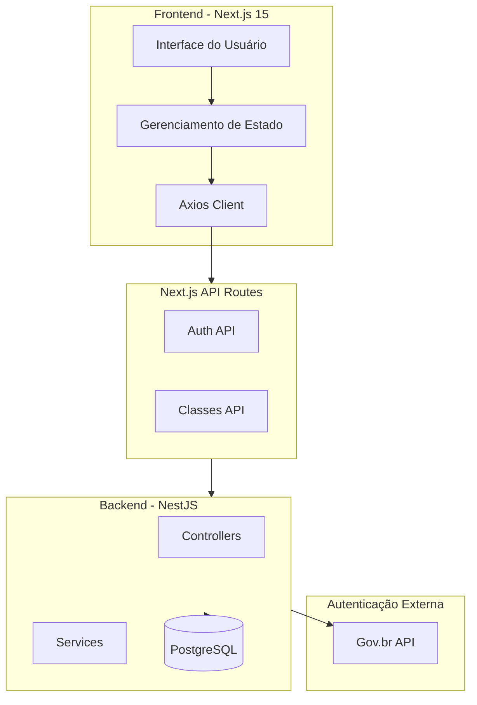

## Arquitetura Backend - Clean Architecture

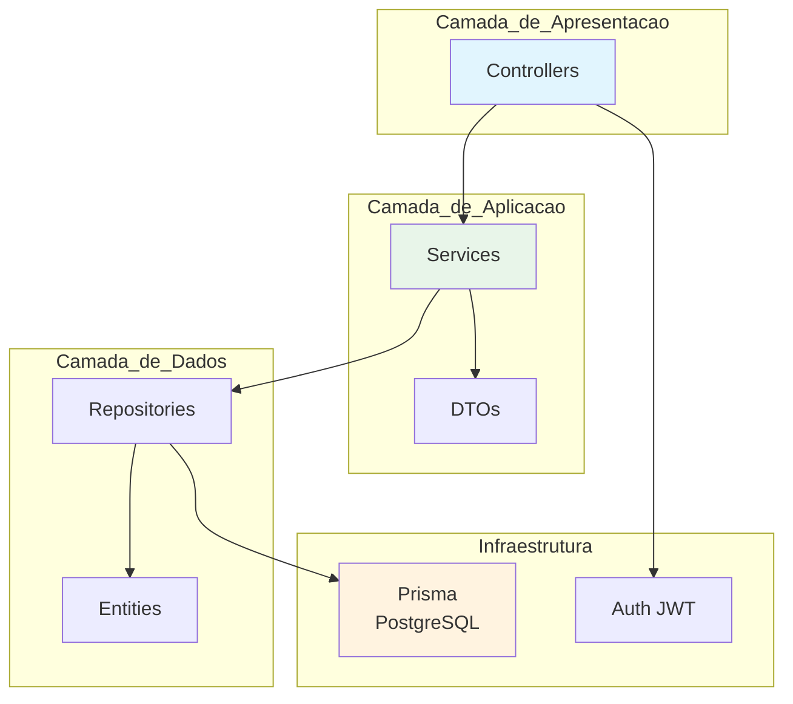

## Estrutura de Módulos Backend

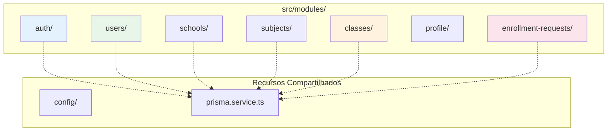

## Arquitetura de Deployment

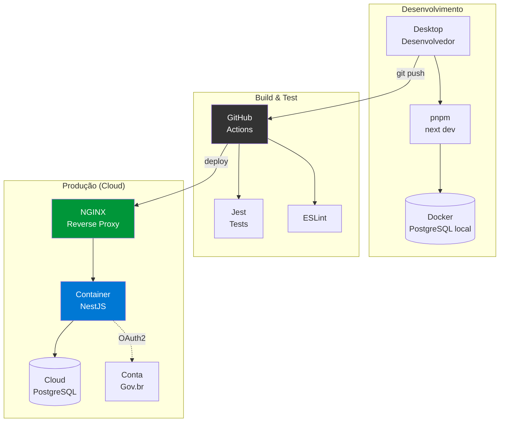

## Fluxo de Dados

### Fluxo de Login

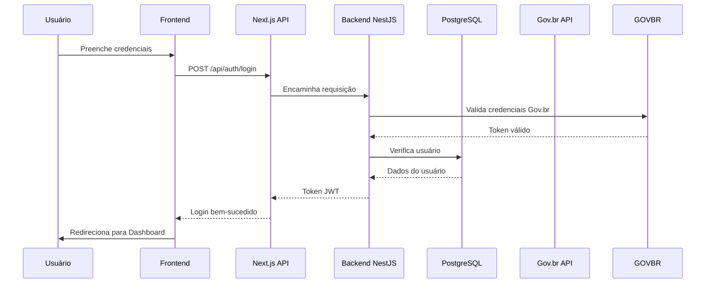

### Fluxo de Criação de Aula Vaga

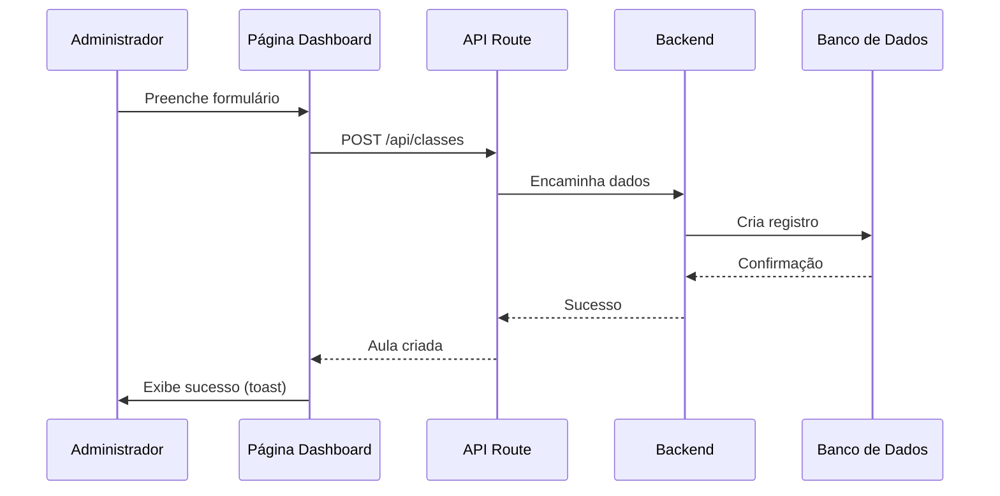

### Fluxo de Candidatura a Aula

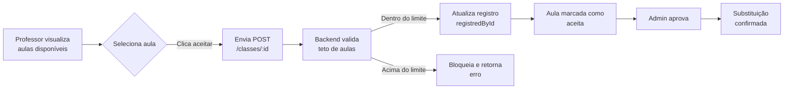

## Arquitetura de Componentes

### Estrutura de Arquivos

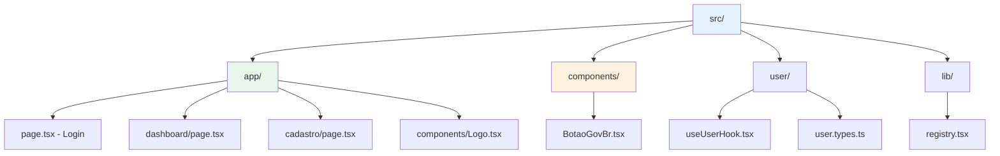

### Padrão Service-Hook-View

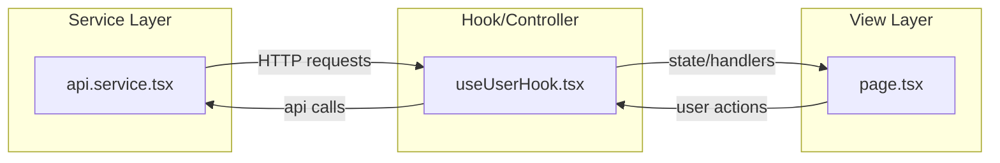

## Estados da Aplicação

### Máquina de Estados - Aula

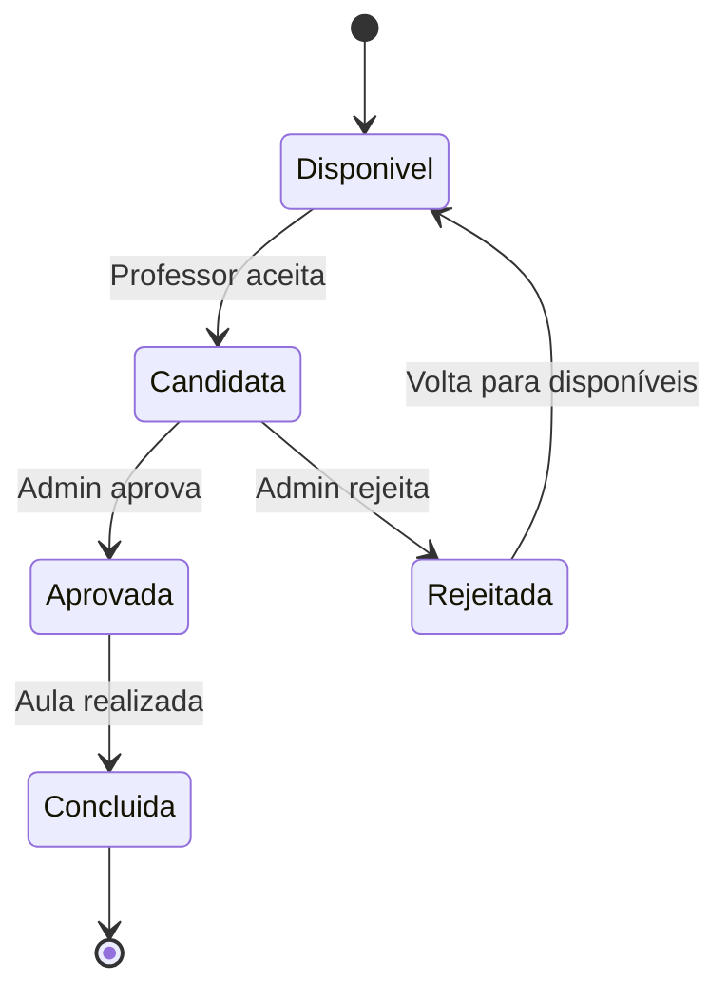

### Fluxo de Usuário

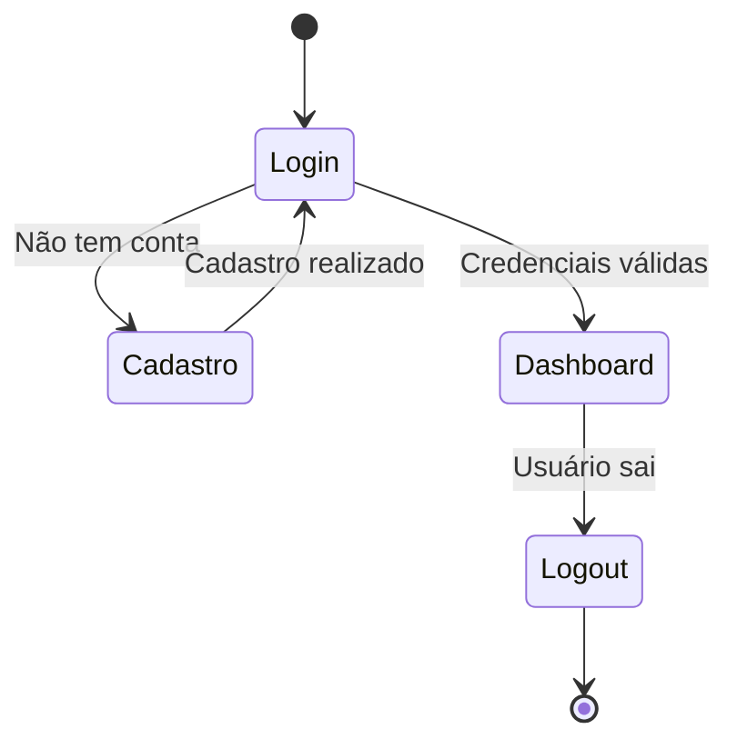

## Middleware e Segurança

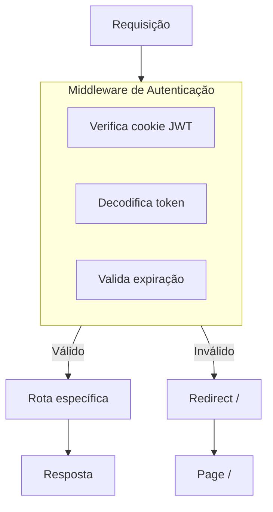

## Máquina de Estados

### Ciclo de Vida de uma Candidatura

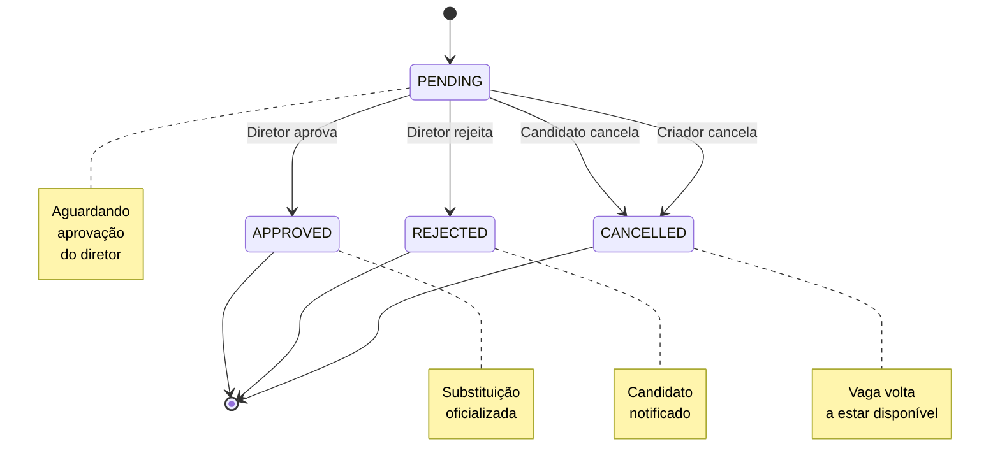

### Ciclo de Vida de uma Aula Vaga

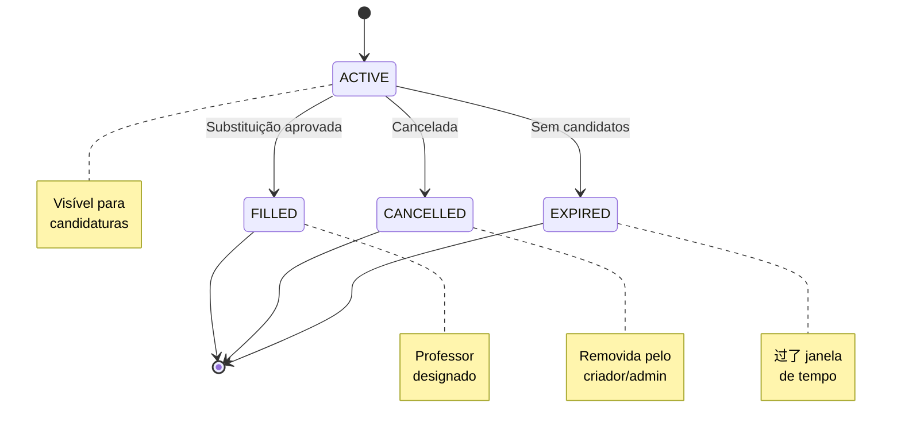

## Validação de Acesso por Perfil

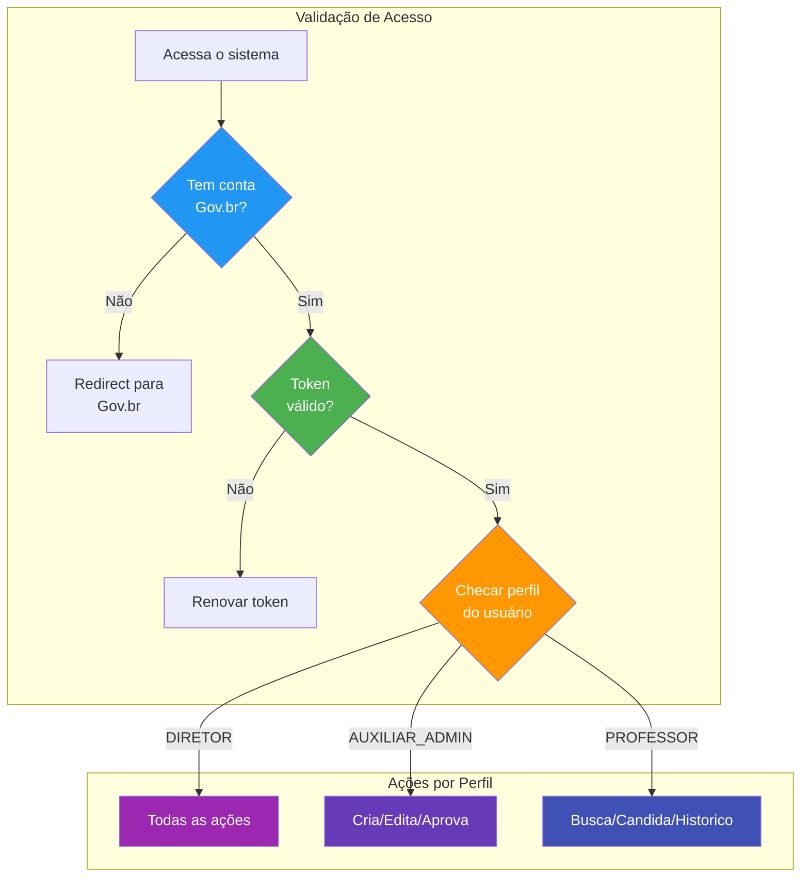

## Validação de Candidatura

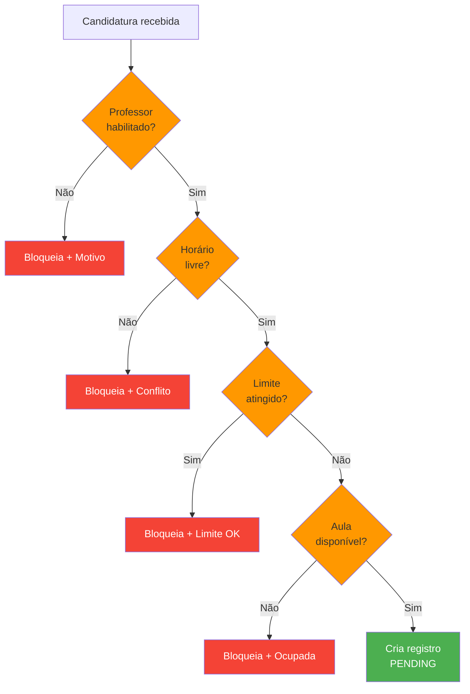

## Estrutura de API

### Endpoints Implementados

| Método | Endpoint | Descrição |
|--------|----------|-----------|
| POST | `/api/auth/login` | Login de usuário |
| POST | `/api/auth/logout` | Logout |
| GET | `/api/auth/me` | Dados do usuário atual |
| POST | `/api/classes` | Criar aula vaga |
| GET | `/api/classes` | Listar aulas |
| PATCH | `/api/classes/:id` | Aceitar/Aprovar aula |
| DELETE | `/api/classes/:id` | Remover aula |
| GET | `/api/schools/:id` | Dados da escola |
| GET | `/api/subjects` | Listar disciplinas |

## Styled Components - Estrutura de Estilos

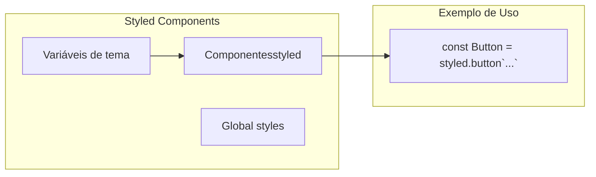

## Variáveis de Ambiente

```env
NEXT_PUBLIC_API_URL=http://localhost:5000
# URL da API backend
```

## Performance e Otimizações

### Estratégias

1. **Server-Side Rendering**: Next.js App Router
2. **Code Splitting**: Automatico pelo Next.js
3. **Image Optimization**: Next.js Image component
4. **Memoization**: useMemo, useCallback
5. **Lazy Loading**: Rotas dinamicas

### Limitações Atuais

- Sem cache de API implementado
- Sem bundle analysis
- Sem optimizações de build