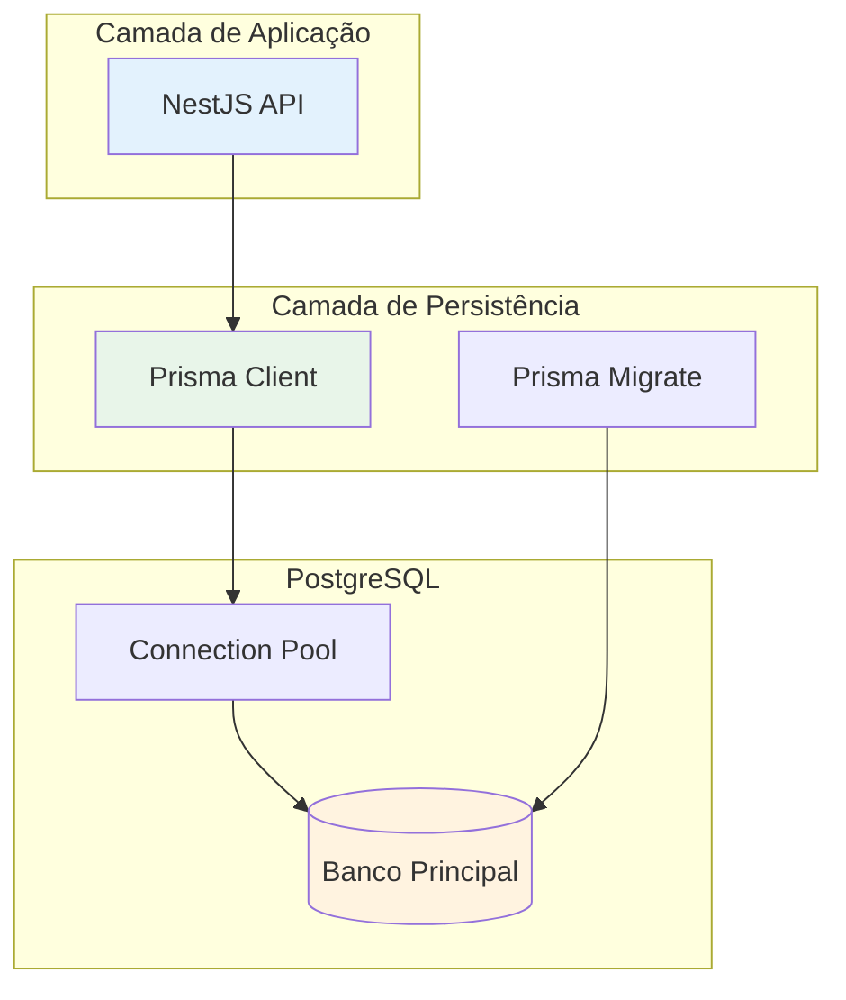
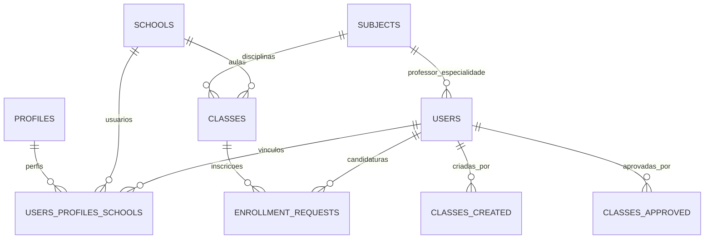
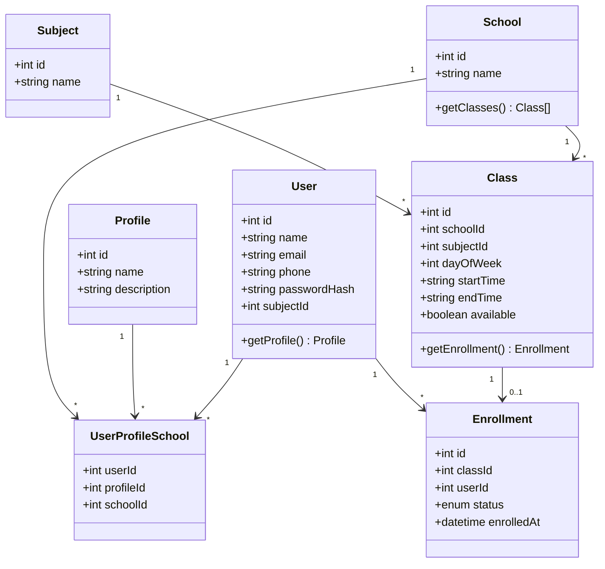

# Modelo de Dados

## Visão Geral do Banco

O banco de dados PostgreSQL é gerenciado pelo **Prisma ORM** e contém todas as entidades do sistema Troca Aula.



## Entidades do Sistema

### Modelo Entidade-Relacionamento



## Tabelas e Estruturas

### USERS (Usuários)

| Campo | Tipo | Descrição |
|-------|------|-----------|
| id | int | PK - Identificador único |
| name | string | Nome completo |
| email | string | Email único |
| phone | string | Telefone de contato |
| passwordHash | string | Senha hasheada (bcrypt) |
| subjectId | int | FK - Disciplina do professor |
| createdAt | datetime | Data de criação |
| deletedAt | datetime | Data de exclusão (soft delete) |

### SCHOOLS (Escolas)

| Campo | Tipo | Descrição |
|-------|------|-----------|
| id | int | PK - Identificador único |
| name | string | Nome da escola |
| createdAt | datetime | Data de criação |
| deletedAt | datetime | Data de exclusão |

### PROFILES (Perfis)

| Campo | Tipo | Descrição |
|-------|------|-----------|
| id | int | PK - Identificador único |
| name | string | Nome do perfil |
| description | string | Descrição |

**Perfis disponíveis**:
- DIRETOR (id: 1)
- PROFESSOR (id: 2)
- AUXILIAR_ADMIN (id: 3)

### SUBJECTS (Disciplinas)

| Campo | Tipo | Descrição |
|-------|------|-----------|
| id | int | PK - Identificador único |
| name | string | Nome da disciplina |
| description | string | Descrição |

### CLASSES (Aulas/Turmas)

| Campo | Tipo | Descrição |
|-------|------|-----------|
| id | int | PK - Identificador único |
| schoolId | int | FK - Escola |
| subjectId | int | FK - Disciplina |
| createdById | int | FK - Quem criou |
| approvedById | int | FK - Quem aprovou |
| statededAt | datetime | Data/hora de início |
| finishedAt | datetime | Data/hora de término |
| available | boolean | Disponível para candidatura |
| enrolledById | int | FK - Professor inscrito |
| createdAt | datetime | Data de criação |
| deletedAt | datetime | Data de exclusão |

### ENROLLMENT_REQUESTS (Candidaturas)

| Campo | Tipo | Descrição |
|-------|------|-----------|
| id | int | PK - Identificador único |
| classId | int | FK - Aula |
| userId | int | FK - Professor candidato |
| status | enum | PENDING, APPROVED, REJECTED, CANCELLED |
| createdAt | datetime | Data de criação |
| updatedAt | datetime | Data de atualização |

### USERS_PROFILES_SCHOOLS (Relacionamento N:N)

| Campo | Tipo | Descrição |
|-------|------|-----------|
| userId | int | FK - Usuário |
| profileId | int | FK - Perfil |
| schoolId | int | FK - Escola |
| approvedAt | datetime | Data de aprovação |

## Diagrama de Classes



## Índices e Constraints

```sql
-- Índices para performance
CREATE INDEX idx_classes_school ON classes(schoolId);
CREATE INDEX idx_classes_subject ON classes(subjectId);
CREATE INDEX idx_classes_available ON classes(available);
CREATE INDEX idx_enrollment_class ON enrollment_requests(classId);
CREATE INDEX idx_enrollment_status ON enrollment_requests(status);
CREATE INDEX idx_users_email ON users(email);

-- Constraints
ALTER TABLE users ADD CONSTRAINT unique_email UNIQUE (email);
ALTER TABLE schools ADD CONSTRAINT unique_name UNIQUE (name);
```

## Migrations

```bash
# Criar nova migration
npx prisma migrate dev --name nome_da_migration

# Aplicar migrations em produção
npx prisma migrate deploy

# Resetar banco de dados
npx prisma migrate reset
```

## Prisma Studio

Para visualizar e editar dados diretamente:

```bash
npx prisma studio
```

Isso abre uma interface web em `http://localhost:5555` para gerenciar os dados.