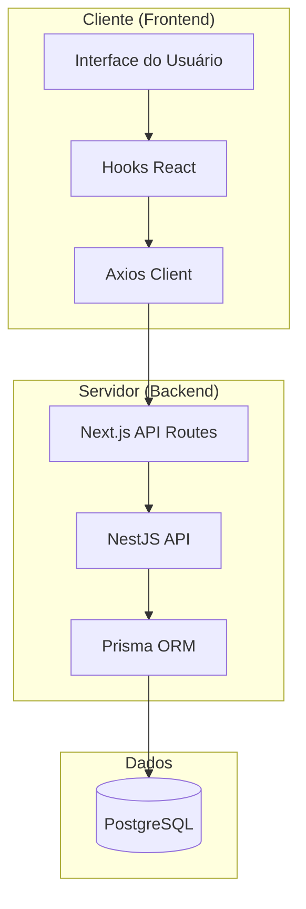
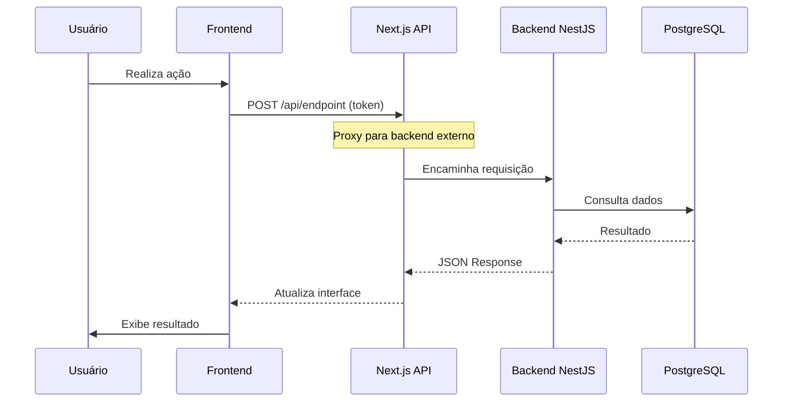
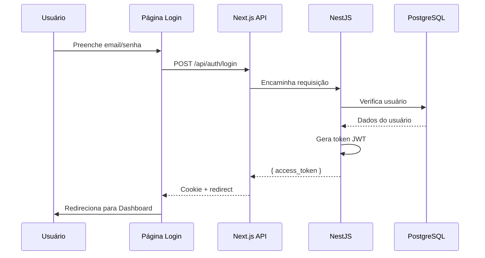
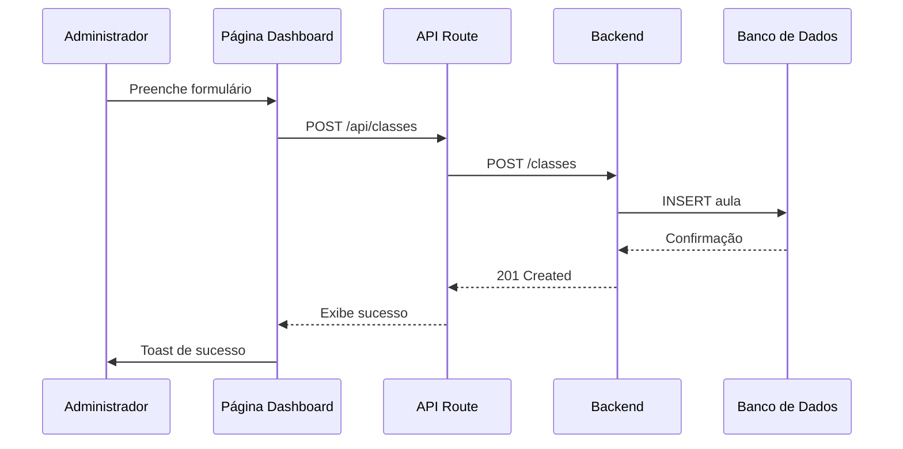
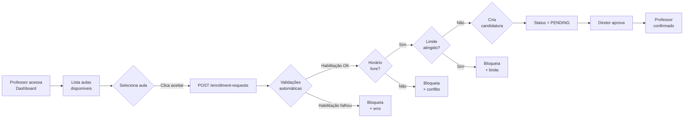
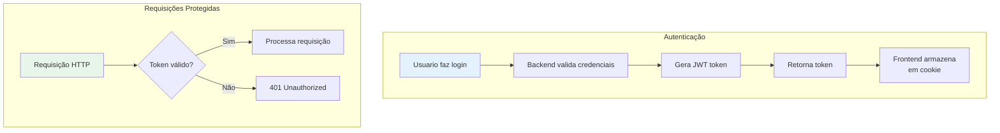

# Integração Frontend-Backend

## Visão Geral da Comunicação



## Fluxo de Requisição



## Endpoints do Backend

### Autenticação

| Método | Endpoint | Descrição |
|--------|----------|-----------|
| POST | `/auth/login` | Login com email/senha |
| POST | `/auth/logout` | Logout |
| GET | `/auth/me` | Dados do usuário atual |

### Classes/Aulas

| Método | Endpoint | Descrição |
|--------|----------|-----------|
| GET | `/classes` | Listar aulas (filtros: schoolId, userId, available) |
| POST | `/classes` | Criar aula vaga |
| GET | `/classes/:id` | Detalhar aula |
| PATCH | `/classes/:id` | Atualizar aula |
| DELETE | `/classes/:id` | Excluir aula |

### Enrollment (Candidaturas)

| Método | Endpoint | Descrição |
|--------|----------|-----------|
| POST | `/enrollment-requests/request/:classId` | Solicitar inscrição |
| GET | `/enrollment-requests` | Listar solicitações |
| PATCH | `/enrollment-requests/:id/approve` | Aprovar inscrição |
| PATCH | `/enrollment-requests/:id/reject` | Rejeitar inscrição |
| DELETE | `/enrollment-requests/:id` | Cancelar solicitação |

### Recursos

| Método | Endpoint | Descrição |
|--------|----------|-----------|
| GET | `/schools/:id` | Dados da escola |
| GET | `/subjects` | Listar disciplinas |
| GET | `/profile` | Listar perfis |

## Integração no Frontend

### API Service (src/api.service.tsx)

```typescript
import axios from "axios";

const api = axios.create({
  baseURL: process.env.NEXT_PUBLIC_API_URL || 'http://localhost:5000'
});

// Interceptor para tratamento de erros
api.interceptors.response.use(
  (success) => success,
  (error) => {
    toast.error(error.response.data.message.join('\n'));
    throw error;
  }
);

export default api;
```

### Environment Variables

```env
# URL do backend (pode ser local ou cloud)
NEXT_PUBLIC_API_URL=http://localhost:5000
# ou em produção
NEXT_PUBLIC_API_URL=https://troca-aula-api.onrender.com
```

## Fluxo de Login



## Fluxo de Criação de Aula Vaga



## Fluxo de Candidatura a Aula



## Tratamento de Erros

### Código de Status HTTP

| Código | Significado | Ação no Frontend |
|--------|-------------|------------------|
| 200 | Sucesso | Exibe dados |
| 201 | Criado | Exibe sucesso + redirect |
| 400 | Erro de validação | Exibe mensagens de erro |
| 401 | Não autenticado | Redirect para login |
| 403 | Não autorizado | Exibe "acesso negado" |
| 404 | Não encontrado | Exibe "não encontrado" |
| 500 | Erro interno | Exibe erro genérico |

### Tratamento no Frontend

```typescript
// Exemplo de tratamento em api.service.tsx
api.interceptors.response.use(
  (success) => success,
  (error) => {
    if (error.response?.status === 401) {
      // Redirect para login
      window.location.href = '/';
    }
    toast.error(error.response?.data?.message || 'Erro interno');
    throw error;
  }
);
```

## Autenticação JWT

### Estrutura do Token

```json
{
  "sub": {
    "id": 1,
    "email": "professor@escola.com"
  },
  "iat": 1715731200,
  "exp": 1715817600
}
```

### Fluxo de Autenticação



## Middleware de Proteção

O frontend Next.js utiliza middleware para proteger rotas:

```typescript
// src/middleware.ts (simplificado)
import { NextResponse } from 'next/server';

export function middleware(request: Request) {
  const token = request.cookies.get('token');
  
  if (!token && !request.url.includes('/')) {
    return NextResponse.redirect(new URL('/', request.url));
  }
  
  return NextResponse.next();
}
```

## Perfis de Usuário e Permissões

| Ação | DIRETOR | PROFESSOR | AUXILIAR_ADMIN |
|------|---------|------------|-----------------|
| Criar SwapRequest | Sim | Não | Sim |
| Aceitar Swap | Sim | Sim | Sim |
| Criar Aula | Sim | Não | Sim |
| Inscrever-se | Sim | Sim | Sim |
| Aprovar Candidatura | Sim | Não | Sim |
| Listar Todas as Aulas | Sim | Não | Sim |

## Configuração de CORS

O backend deve permitir requisições do frontend:

```typescript
// No NestJS
app.enableCors({
  origin: process.env.FRONTEND_URL || 'http://localhost:3000',
  credentials: true,
});
```

## Variáveis de Ambiente

### Backend (.env)

```env
DATABASE_URL=postgresql://...
JWT_SECRET=sua_chave_secreta
PORT=3000
FRONTEND_URL=http://localhost:3000
```

### Frontend (.env.local)

```env
NEXT_PUBLIC_API_URL=http://localhost:5000
```

## Status de Integração

| Funcionalidade | Frontend | Backend | Status |
|----------------|----------|---------|--------|
| Login | ✅ | ✅ | Completo |
| Logout | ✅ | ✅ | Completo |
| Criar aula | ✅ | ✅ | Completo |
| Listar aulas | ✅ | ✅ | Completo |
| Candidatar-se | ✅ | ✅ | Completo |
| Aprovar | ✅ | ✅ | Completo |
| Gov.br OAuth | 🔄 | ✅ | Em desenvolvimento |
| Teto de aulas | ❌ | ✅ | Pendente |