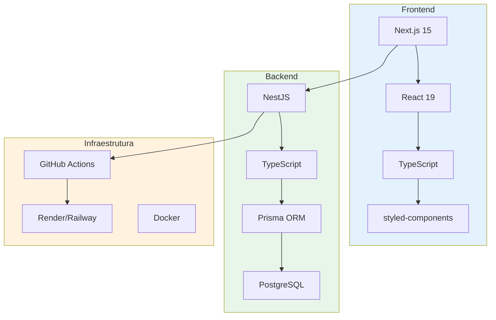
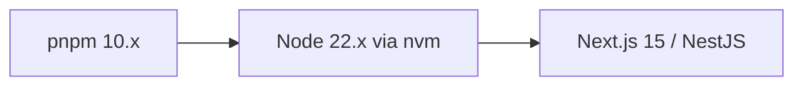
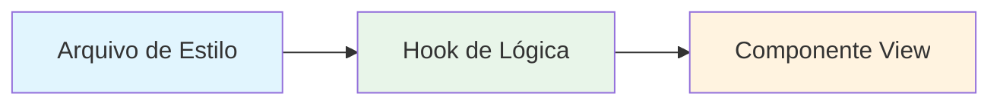

# Stack Tecnológica

## Visão Geral



## Frontend

| Tecnologia | Versão | Propósito |
|------------|--------|-----------|
| Next.js | 15.3.2 | Framework React com App Router |
| React | 19.0.0 | Biblioteca UI |
| TypeScript | 5.x | Tipagem estática |
| styled-components | 6.1.18 | Estilização CSS-in-JS |
| React Hook Form | 7.56.4 | Gerenciamento de formulários |
| Yup | 1.6.1 | Validação de esquemas |
| Axios | 1.9.0 | Cliente HTTP |
| date-fns | 4.1.0 | Manipulação de datas |
| react-toastify | 11.0.5 | Notificações toast |

## Backend

| Tecnologia | Versão | Propósito |
|------------|--------|-----------|
| NestJS | Latest | Framework Node.js |
| TypeScript | 5.x | Tipagem estática |
| Prisma | Latest | ORM para banco de dados |
| PostgreSQL | Latest | Banco de dados relacional |
| JWT | Latest | Autenticação por token |
| bcrypt | Latest | Hash de senhas |
| class-validator | Latest | Validação de DTOs |

## Testing

| Tecnologia | Versão | Propósito |
|------------|--------|-----------|
| Vitest | 4.1.2 | Test runner (Frontend) |
| Jest | Latest | Test runner (Backend) |
| React Testing Library | 16.3.2 | Testes de componentes |
| Jest DOM | 6.9.1 | Matchers para DOM |
| MSW | 2.12.14 | Mock de Service Worker |
| Supertest | Latest | Testes de API HTTP |

## Infraestrutura

| Tecnologia | Propósito |
|------------|-----------|
| GitHub Actions | CI/CD automático |
| Docker | Containerização |
| Render/Railway | Hospedagem em nuvem |
| PostgreSQL Cloud | Banco de dados gerenciado |

## Gerenciador de Pacotes



- **Package Manager**: pnpm 10.11.0
- **Node Version**: 22.x (gerenciado via nvm)

## Estrutura de Diretórios

```
src/
├── app/                    # Next.js App Router
│   ├── page.tsx           # Página inicial (Login)
│   ├── dashboard/         # Dashboard principal
│   ├── cadastro/          # Cadastro de usuários
│   ├── components/        # Componentes compartilhados
│   ├── api/               # Rotas API do Next.js
│   ├── layout.tsx         # Layout raiz
│   └── globals.css        # Estilos globais
├── components/             # Componentes externos
├── user/                  # Hooks e tipos de usuário
├── api.service.tsx        # Serviço de API
└── middleware.ts         # Middleware de autenticação
```

## Convenções de Código

### Padrão de Arquivos

```
*.service.tsx      → Chamadas API e integração
use*.ts/tsx        → Hooks de lógica (controllers)
*.tsx (pasta)     → Componente visual
*.styles.ts       → Arquivo de estilos separado
```

### Padrão de Componentes



### Nomenclatura

- Componentes: PascalCase (`Logo.tsx`, `BotaoGovBr.tsx`)
- Hooks: camelCase com prefixo `use` (`useUserHook.tsx`)
- Services: PascalCase (`ApiService.tsx`)
- Tipos: PascalCase (`UserData.tsx`)

## Qualidade de Código

### Commit Messages

Seguir Conventional Commits:
```
feat:      Nova funcionalidade
fix:       Correção de bug
docs:      Documentação
refactor:  Refatoração
test:      Testes
```

### Linting e Formatting

- ESLint para análise estática
- Prettier para formatação
- commitlint para validação de commits

### Testes

- Testes unitários para lógica de negócio
- Testes de integração para API
- Testes de componentes para UI