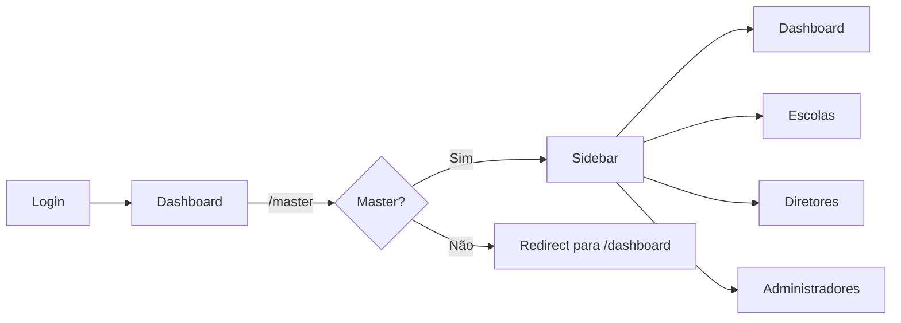

# Research: Área Administrativa Master

## Decisões de Implementação

### Stack Tecnológica

| Componente | Decisão | Rationale |
|------------|---------|-----------|
| Framework | Next.js 15 (App Router) | Já utilizado no projeto |
| Linguagem | TypeScript | Já utilizado no projeto |
| Estilização | styled-components | Já utilizado no projeto |
| Validação | React Hook Form + Yup | Já utilizado no projeto |
| HTTP Client | Axios | Já utilizado no projeto (api.service.tsx) |
| Testing | Vitest + React Testing Library | Já utilizado no projeto |

### Arquitetura de Rotas

**Decisão**: Usar Next.js App Router com nova rota `/master`

```text
src/app/master/
├── page.tsx              // Layout principal com sidebar
├── dashboard/
│   └── page.tsx         // Dashboard com cards
├── escolas/
│   ├── page.tsx         // Lista de escolas
│   └── [id]/
│       └── page.tsx     // Editar escola
├── diretores/
│   └── page.tsx         // Lista e criar diretores
└── administradores/
    └── page.tsx         // Lista e criar administradores
```

### Padrão de Componentes (seguindo Constitution)

Cada feature seguirá:
- `*.service.tsx` - chamadas API
- `use*.ts` ou `use*.tsx` - hooks de lógica
- `*.tsx` (em pasta) - componente visual
- styled no mesmo arquivo - estilização

### Endpoints da API Consumidos

| Recurso | Método | Endpoint | Descrição |
|---------|--------|-----------|------------|
| Schools | GET | /schools | Lista todas |
| Schools | POST | /schools | Criar |
| Schools | GET | /schools/:id | Detalhar |
| Schools | PATCH | /schools/:id | Editar |
| Schools | DELETE | /schools/:id | Excluir |
| Users | GET | /users?profileId=X | Listar por perfil |
| Users | GET | /users?schoolId=X | Listar por escola |
| Users | POST | /users | Criar usuário |
| Users | PATCH | /users/:id | Editar |
| Users | DELETE | /users/:id | Excluir |
| Classes | GET | /classes?available=true | Aulas vagas |
| Enrollment | GET | /enrollment-requests?status=APPROVED | Contagem substituições |

### Autenticação e Autorização

- O hook `useUserHook` já existe e retorna `user.profileId`
- Proteção de rota será feita via middleware ou verificação no layout
- JWT token já está configurado no api.service.tsx

### Fluxo de Navegação



### Componentização Planejada

| Componente | Propósito |
|------------|-----------|
| MasterLayout | Layout principal com header + sidebar |
| StatCard | Card para dashboard (estilo já usado em Dashboard) |
| DataTable | Tabela reutilizável para listas |
| ConfirmModal | Modal de confirmação para exclusão |
| SchoolForm | Formulário de escola |
| UserForm | Formulário de diretor/admin |
| Toast | Feedback (já existe react-toastify) |

---

## Alternativas Consideradas

### Biblioteca de UI

**Alternativa**: Usar MUI ou Chakra UI
**Motivo de escolha**: styled-components já está em uso, manter consistência

### Estado Global

**Alternativa**: Redux / Zustand
**Motivo de escolha**: React useState/useContext é suficiente para esta feature

### Rotas via API Routes vs Backend direto

**Alternativa**: Chamadas diretas ao backend
**Motivo de escolha**: Já existe api.service.tsx com interceptors, manter padrão

---

## Conclusão

A implementação será direta seguindo os padrões existentes do projeto. Não há NEEDS CLARIFICATION - todas as decisões foram baseadas na tecnologia já estabelecida no projeto.