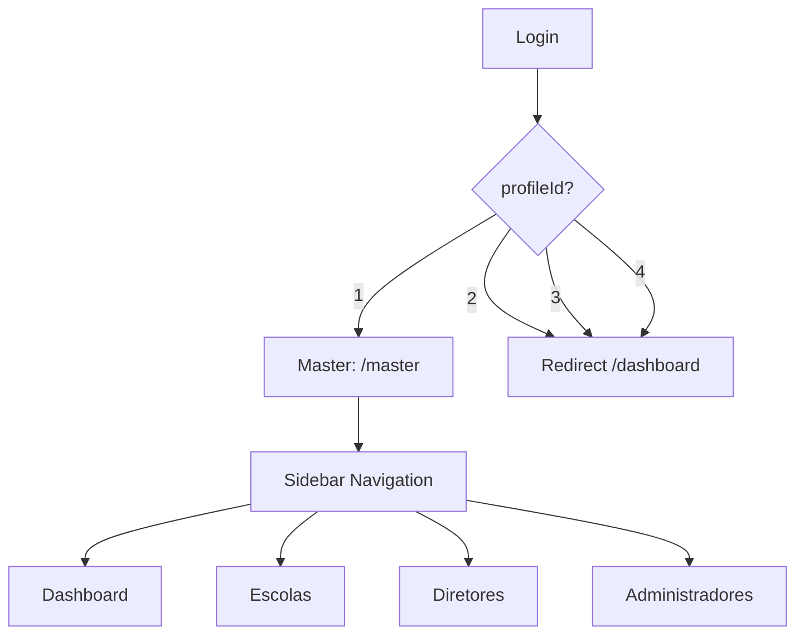
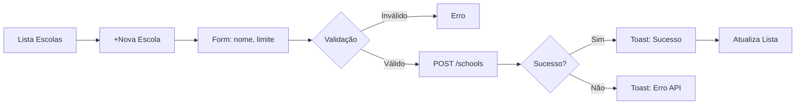

# Feature Specification: Área Administrativa Master

**Feature Branch**: `[001-master-admin-area]`

**Created**: 2026-05-16

**Status**: Draft

**Input**: User description: "O sistema precisa de uma área administrativa completa para o usuário Master gerenciar todo o sistema. O Master é o usuário com privilégios totais, capaz de gerenciar escolas, diretores e administradores."

## User Scenarios & Testing *(mandatory)*

### User Story 1 - Acesso à Área Administrativa (Priority: P1)

**Como** usuário Master,
**Eu quero** acessar uma área administrativa segura com todas as funcionalidades de gestão,
**Para que** eu possa gerenciar escolas, diretores e administradores do sistema.

**Why this priority**: Esta é a funcionalidade principal que permite ao Master acessar o sistema administrativo. Sem ela, não é possível gerenciar nenhuma outra funcionalidade.

**Independent Test**: pode ser testado completamente efetuando login com credenciais de Master e acessando a rota /master. O acesso deve ser bloqueado para outros perfis.

**Acceptance Scenarios**:

1. **Given** o usuário está logado com perfil Master (profileId=1), **When** acessa a URL /master, **Then** a área administrativa é exibida com sidebar e conteúdo
2. **Given** o usuário está logado com perfil Diretor (profileId=2), **When** acessa a URL /master, **Then** o acesso é negado e redirecionado para o dashboard
3. **Given** o usuário está logado com perfil Administrador (profileId=3), **When** acessa a URL /master, **Then** o acesso é negado e redirecionado para o dashboard
4. **Given** o usuário está logado com perfil Professor (profileId=4), **When** acessa a URL /master, **Then** o acesso é negado e redirecionado para o dashboard

---

### User Story 2 - Gerenciar Escolas (Priority: P1)

**Como** usuário Master,
**Eu quero** criar, visualizar, editar e excluir escolas,
**Para que** eu possa manter o cadastro das instituições de ensino no sistema.

**Why this priority**: As escolas são a base do sistema. Sem escolas, não é possível ter diretores, administradores ou professores vinculados.

**Independent Test**: pode ser testado criando uma nova escola, verificando que aparece na lista, editando seus dados e excluindo-a.

**Acceptance Scenarios**:

1. **Given** estou na página de escolas, **When** clico no botão "+ Nova Escola", **Then** um formulário abre para preenchimento
2. **Given** o formulário está preenchido com nome válido, **When** clico em "Salvar", **Then** a escola é criada e aparece na lista com mensagem de sucesso
3. **Given** existe uma escola cadastrada, **When** clico em "Editar", **Then** o formulário abre com os dados preenchidos para alteração
4. **Given** existe uma escola cadastrada, **When** clico em "Excluir", **Then** uma mensagem de confirmação aparece antes da exclusão
5. **Given** tento criar escola sem nome, **Then** o sistema exibe erro de validação indicando campo obrigatório

---

### User Story 3 - Gerenciar Diretores (Priority: P1)

**Como** usuário Master,
**Eu quero** criar, visualizar, editar e desvincular diretores,
**Para que** eu possa manter o cadastro dos diretores vinculados às escolas.

**Why this priority**: Os diretores são responsáveis pela governança das escolas e precisam estar vinculados às suas respectivas instituições.

**Independent Test**: pode ser testado criando um novo diretor vinculado a uma escola, verificando que aparece na lista de diretores daquela escola.

**Acceptance Scenarios**:

1. **Given** estou na página de diretores, **When** clico em "+ Novo Diretor", **Then** um formulário abre com campos: nome, email, telefone, senha e escola
2. **Given** o formulário está preenchido com dados válidos, **When** clico em "Salvar", **Then** o diretor é criado vinculado à escola escolhida
3. **Given** existe um diretor cadastrado, **When** clico em "Desvincular", **Then** o vínculo com a escola é removido mas o usuário permanece no sistema
4. **Given** tento criar diretor sem selecionar escola, **Then** o sistema exibe erro indicando que a escola é obrigatória

---

### User Story 4 - Gerenciar Administradores (Priority: P1)

**Como** usuário Master,
**Eu quero** criar, visualizar, editar e desvincular administradores,
**Para que** eu possa manter o cadastro dos administradores vinculados às escolas.

**Why this priority**: Os administradores são responsáveis pela operação das substituições nas escolas.

**Independent Test**: pode ser testado criando um novo administrador vinculado a uma escola, verificando que aparece na lista.

**Acceptance Scenarios**:

1. **Given** estou na página de administradores, **When** clico em "+ Novo Administrador", **Then** um formulário abre com campos: nome, email, telefone, senha e escola
2. **Given** o formulário está preenchido com dados válidos, **When** clico em "Salvar", **Then** o administrador é criado vinculado à escola escolhida
3. **Given** existe um administrador cadastrado, **When** clico em "Desvincular", **Then** o vínculo com a escola é removido mas o usuário permanece no sistema
4. **Given** tento criar administrador sem selecionar escola, **Then** o sistema exibe erro indicando que a escola é obrigatória

---

### User Story 5 - Visualizar Dashboard Global (Priority: P2)

**Como** usuário Master,
**Eu quero** ver estatísticas globais do sistema,
**Para que** eu possa monitorar o desempenho e usage do sistema.

**Why this priority**: O dashboard permite ao Master ter visão geral do sistema sem precisar navegar para detalhes.

**Independent Test**: pode ser testado acessando o dashboard e verificando que os números são exibidos corretamente.

**Acceptance Scenarios**:

1. **Given** estou logado como Master, **When** acesso o dashboard da área administrativa, **Then** vejo cards com: total de escolas, total de aulas vagas ativas, total de substituições este mês
2. **Given** o sistema tem dados cadastrados, **When** o dashboard carrega, **Then** os valores numéricos são exibidos corretamente

---

### Edge Cases

- O que acontece quando se tenta excluir uma escola que tem diretores ou administradores vinculados? O sistema deve impedir a exclusão ou exigir desvinculação primeiro.
- O que acontece quando se tenta criar um usuário com email que já existe no sistema? O sistema deve informar que o email já está em uso.
- O que acontece quando a API de usuários retorna erro? O sistema deve exibir a mensagem de erro da API para o usuário.
- O que acontece quando não há escolas cadastradas? O sistema deve exibir mensagem indicando que não existem escolas e orientando a criar uma.

---

## Requirements *(mandatory)*

### Functional Requirements

- **FR-001**: O sistema DEVE proteger a rota /master permitindo apenas usuários com profileId=1 (Master)
- **FR-002**: O sistema DEVE permitir ao Master criar novas escolas com nome (obrigatório) e limite de substituições opcional
- **FR-003**: O sistema DEVE permitir ao Master editar dados de escolas existentes
- **FR-004**: O sistema DEVE permitir ao Master excluir escolas, com confirmação prévia
- **FR-005**: O sistema DEVE listar todas as escolas cadastradas em formato de tabela
- **FR-006**: O sistema DEVE permitir ao Master criar diretores com uma única chamada POST para /users incluindo: nome (obrigatório), email (válido), telefone (opcional), senha (opcional), schoolId e profileId=2
- **FR-007**: O sistema DEVE permitir ao Master criar administradores com uma única chamada POST para /users incluindo: nome (obrigatório), email (válido), telefone (opcional), senha (opcional), schoolId e profileId=3
- **FR-008**: O sistema DEVE permitir ao Master desvincular diretores de suas escolas
- **FR-009**: O sistema DEVE permitir ao Master desvincular administradores de suas escolas
- **FR-010**: O sistema DEVE exibir dashboard com 3 cards: total de escolas, total de aulas vagas ativas, total de substituições este mês
- **FR-011**: O sistema DEVE validar formulários: nome obrigatório, email com formato válido, demais campos opcionais
- **FR-012**: O sistema DEVE exibir mensagens toast com mensagem específica da API quando disponível, fallback para mensagem genérica
- **FR-013**: O sistema DEVE confirmar com modal antes de excluir registros

### Key Entities

- **Escola (School)**: Representa uma instituição de ensino, com atributos: id, name, substitutionLimitPerSemester, createdAt
- **Usuário (User)**: Representa pessoas no sistema, com atributos: id, name, email, phone, passwordHash, subjectId, createdAt
- **Perfil (Profile)**: Define o tipo de acesso do usuário: id, name, description
- **Vínculo Usuário-Escola-Perfil**: Relaciona usuários a escolas com um perfil específico

---

## Success Criteria *(mandatory)*

### Measurable Outcomes

- **SC-001**: Usuários Master podem acessar a área administrativa em até 2 segundos após login
- **SC-002**: O sistema impede acesso de usuários não-Master à área administrativa com 100% de eficácia
- **SC-003**: Todas as operações CRUD de escolas resultam em feedback visual em até 1 segundo
- **SC-004**: O dashboard exibe dados atualizados ao carregar a página (sem atualização automática)

---

## Assumptions

- Assume-se que a API backend já expõe os endpoints necessários (GET/POST/PATCH/DELETE para schools e users)
- Assume-se que a autenticação via JWT está funcionando corretamente
- Assume-se que o perfil do usuário logado está disponível no hook useUserHook existente
- Assume-se que a estrutura de diretórios do projeto Next.js 15 permite a criação de novas rotas
- Assume-se que as libraries de UI já utilizadas no projeto (styled-components, react-toastify, react-hook-form) estão disponíveis
- Assume-se que o componente de modal de confirmação pode ser implementado ou reutilizado de biblioteca existente

---

## Clarifications

### Session 2026-05-16

- Q: O dashboard deve mostrar apenas 3 cards ou há outras métricas? → A: Apenas 3 cards: Escolas, Aulas Vagas, Substituições do mês
- Q: Os dados do dashboard devem se atualizar automaticamente? → A: Dados atualizados ao carregar a página (sem refresh automático)
- Q: Ao criar diretor/admin, quantas chamadas fazer? → A: Uma chamada POST para /users com schoolId e profileId (cria usuário + vínculo)
- Q: Quais são as regras de validação para criação de escolas e usuários? → A: Nome obrigatório, email válido, campos restantes opcionais
- Q: Como tratar os diferentes tipos de erro da API? → A: Toast com mensagem específica da API quando disponível, genérica fallback

---

---

## Diagrams

### User Flow - Access Control

### CRUD Flow - Escolas

---

**Version**: 1.0.1