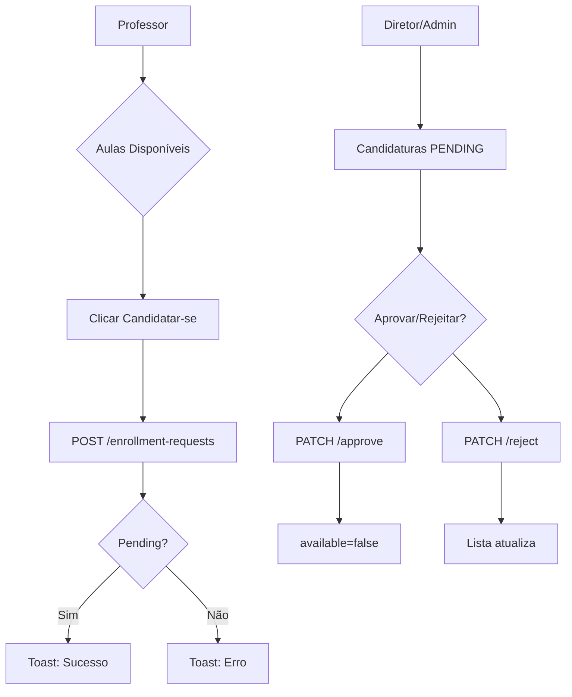
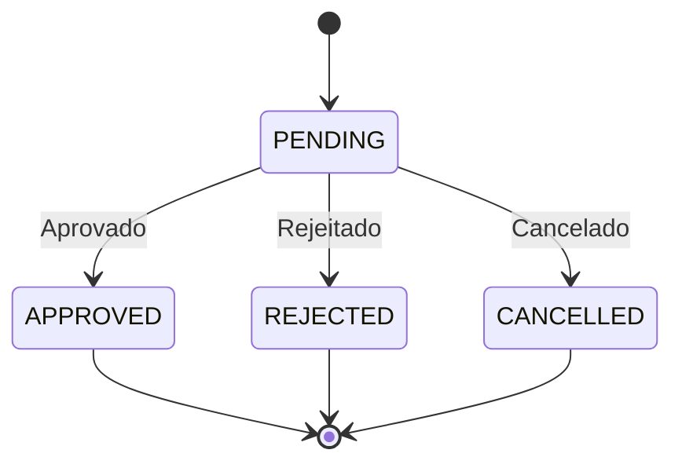

# Implementation Plan: Sistema de Candidaturas de Aulas

**Branch**: `002-class-enrollment` | **Date**: 2026-05-17 | **Spec**: [spec.md](./spec.md)

**Input**: Feature specification from `/specs/002-class-enrollment/spec.md`

## Summary

Desenvolver o sistema de candidaturas de aulas onde professores podem se candidatar a aulas disponíveis e diretores/admins podem aprovar ou rejeitar essas candidaturas. A implementação segue o fluxo formal de enrollment requests, substituindo o método incorreto de PATCH direto nas classes.

## Technical Context

**Language/Version**: TypeScript 5.x

**Primary Dependencies**: 
- Next.js 15 (App Router)
- React 19
- styled-components 6.x
- react-hook-form (já utilizado)
- react-toastify (já utilizado)
- Axios (api.service.tsx existente)

**Storage**: N/A (Frontend apenas, consome API REST)

**Testing**: Vitest + React Testing Library (já configurados no projeto)

**Target Platform**: Web (navegadores modernos)

**Project Type**: Web Application (Next.js 15)

**Performance Goals**: 
- Tempo de resposta de candidatura < 2 segundos
- Atualização instantânea após aprovação

**Constraints**: 
- Seguir padrão de componentes da Constitution (service/hook/view/style separados)
- WCAG 2.1 para acessibilidade
- Test-First para funcionalidades críticas (como Authentication na Constitution)
- Usar diagramas Mermaid para fluxos

**Scale/Scope**: 
- 5 páginas/componentes principais
- Formulários para candidacy e aprovação
- Lists com filtros por status

## Constitution Check

| Princípio | Status | Observação |
|----------|--------|-------------|
| I. Acessibilidade WCAG | ✅ Pass | Elementos de interface devem seguir padrões |
| II. Arquitetura Modular | ✅ Pass | Cada feature terá service/hook/view/style |
| III. Test-First | ✅ Pass | Testes para funcionalidades críticas (candidatura, aprovação) |
| IV. Padrão Componentes | ✅ Pass | Usar styled-components, PascalCase |
| V. Simplicity First | ✅ Pass | Começar simples, iterar se necessário |
| VI. Mermaid | ✅ Pass | Diagramas incluídos no spec e plan |

## Project Structure

### Documentation (this feature)

```text
specs/002-class-enrollment/
├── plan.md              # This file
├── research.md          # Phase 0 output
├── data-model.md        # Phase 1 output
├── quickstart.md        # Phase 1 output
├── contracts/          # Phase 1 output
└── tasks.md             # Phase 2 (NOT created by /speckit.plan)
```

### Source Code (repository root)

```text
# Web application (frontend)
src/
├── app/
│   ├── classes/                    #现有classes页面
│   │   └── page.tsx               # Aulas disponíveis
│   ├── minhas-aulas/              # NOVA ROTA
│   │   └── page.tsx               # Minhas candidaturas (professor)
│   ├── dashboard/
│   │   └── page.tsx               #现有dashboard
│   └── components/                # Componentes compartilhados
├── hooks/                         # useEnrollment, useMyEnrollments
├── services/                      # enrollment.service.tsx
└── types/                         # enrollment.ts (types)
```

**Structure Decision**: Web application com Next.js App Router. Nova pasta para "Minhas Aulas" (professor) e extensão do dashboard para "Candidaturas" (diretor/admin).

---

## Phase 0: Research

### Decisions Made

1. **API Service Layer**: Reutilizar api.service.tsx existente, criar enrollment.service.tsx para endpoints específicos
2. **Hooks Pattern**: Criar useEnrollment para mutations (create, cancel, approve, reject) e useEnrollments para listagens
3. **State Management**: React useState/useContext é suficiente para esta feature
4. **UI Components**: Reutilizar ConfirmModal existente, criar Tabs component se necessário

---

## Phase 1: Design & Contracts

### Entities

**EnrollmentRequest (Candidatura)**:
- id: number
- classId: number
- userId: number
- status: PENDING | APPROVED | REJECTED | CANCELLED
- rejectionReason?: string (nullable)
- createdAt: datetime

**Class (Aula)**:
- id: number
- subjectId: number
- date: datetime
- available: boolean (atualiza para false quando aprovada)

### API Contracts

```typescript
// POST /enrollment-requests
interface CreateEnrollmentRequest {
  classId: number;
}

// GET /enrollment-requests?status=PENDING
interface EnrollmentListResponse {
  data: EnrollmentRequest[];
}

// PATCH /enrollment-requests/:id/approve
// PATCH /enrollment-requests/:id/reject
interface EnrollmentActionResponse {
  data: EnrollmentRequest;
}
```

---

## Diagrams

### Enrollment Flow



### Status Transitions



---

**Version**: 1.0.0