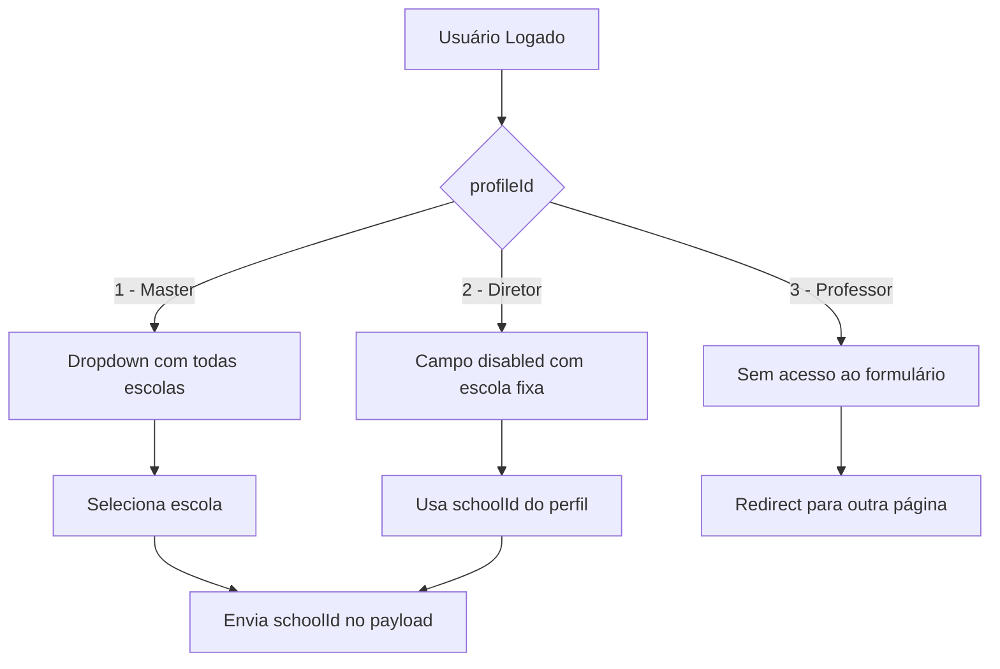
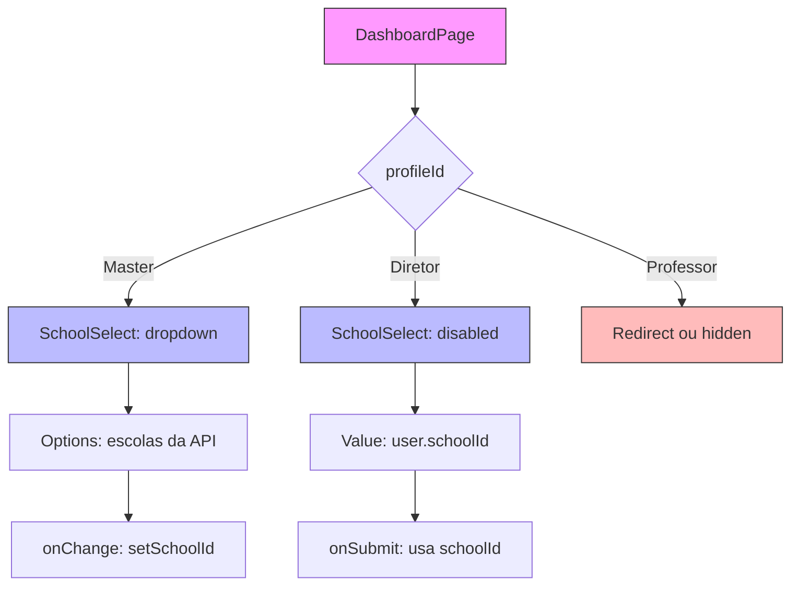

# Implementation Plan: School Selection by User Profile

**Branch**: `[003-school-profile-dynamic]` | **Date**: 2026-05-17 | **Spec**: [spec.md](./spec.md)

**Input**: Feature specification from `/specs/003-school-profile-dynamic/spec.md`

## Summary

Modificar o formulário de criação de aula para que o campo escola (schoolId) seja dinâmico baseado no perfil do usuário logado: Master vê dropdown com todas as escolas, Diretor/Admin vê escola fixa (disabled), Professor não acessa o formulário.

## Technical Context

**Language/Version**: TypeScript 5.x

**Primary Dependencies**: 
- Next.js 15 (App Router)
- React 19
- styled-components 6.x
- Axios (api.service.tsx existente)
- useUserHook (existente)

**Storage**: N/A (Frontend apenas, consome API REST)

**Testing**: Vitest + React Testing Library (já configurados no projeto)

**Target Platform**: Web (navegadores modernos)

**Project Type**: Web Application (Next.js 15)

**Performance Goals**: N/A (modificação de UI simples)

**Constraints**: 
- Seguir padrão de componentes da Constitution (service/hook/view/style separados)
- WCAG 2.1 para acessibilidade
- Usar diagramas Mermaid para fluxos

**Scale/Scope**: 
- 1 página para modificar (dashboard page)
- 1 componente reutilizável (SchoolSelect)
- Conexão com endpoints existentes (/schools, /auth/me)

## Constitution Check

| Princípio | Status | Observação |
|-----------|--------|-------------|
| I. Acessibilidade WCAG | ✅ Pass | Elementos de interface devem seguir padrões |
| II. Arquitetura Modular | ✅ Pass | Cada feature terá service/hook/view/style |
| III. Test-First | ⚠️ Optional | Funcionalidade de UI simples - não crítica |
| IV. Padrão Componentes | ✅ Pass | Usar styled-components, PascalCase |
| V. Simplicity First | ✅ Pass | Solução direta e minimalista |
| VI. Mermaid | ✅ Pass | Diagramas incluídos no spec e plan |

## Project Structure

### Documentation (this feature)

```text
specs/003-school-profile-dynamic/
├── plan.md              # This file
├── spec.md              # Feature specification
├── data-model.md        # Phase 1 output
├── quickstart.md        # Phase 1 output
├── contracts/           # Phase 1 output
└── checklists/          # Quality checklists
```

### Source Code (repository root)

```text
src/
├── app/
│   └── dashboard/       # Página existente com formulário de criar aula
├── components/          # Componentes compartilhados (novo SchoolSelect)
├── services/            # Services (reutilizar master.service.tsx existente)
├── hooks/               # Hooks (reutilizar useUserHook existente)
└── types/               # Types (adicionar ao master.ts existente)
```

**Structure Decision**: Web application com Next.js App Router. Modificar dashboard page existente para adicionar componente SchoolSelect dinâmico baseado no perfil.

---

## Phase 0: Research

### Decisions Made

1. **API Service**: Reutilizar master.service.tsx existente para getSchools()
2. **User Data**: Reutilizar useUserHook existente que já retorna schoolId e profileId
3. **SchoolSelect Component**: Criar componente dedicado para renderização condicional
4. **State Management**: useState local para school selection, useEffect para carregar escolas

---

## Phase 1: Design & Contracts

### Entities

**School (Escola)**:
- id: number
- name: string

**User (Usuário)** - já existente:
- id: number
- name: string
- profileId: number (1=Master, 2=Diretor, 3=Professor)
- schoolId: number | null

### API Contracts

```typescript
// GET /schools (já existe em master.service.tsx)
interface School {
  id: number;
  name: string;
}

// GET /auth/me (já existe em useUserHook)
interface UserData {
  id: number;
  name: string;
  email: string;
  profileId: number;
  schoolId: number | null;
}

// POST /classes (payload atual)
interface CreateClassRequest {
  schoolId: number;     // ← Será dinâmico baseado no perfil
  subjectId: number;
  statededAt: string;
  finishedAt: string;
}
```

---

## Diagrams

### School Selection Flow



### Component Structure



---

**Version**: 1.0.0