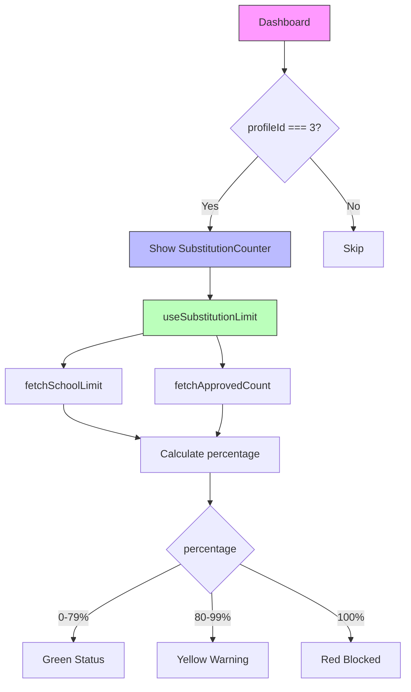

# Implementation Plan: Substitution Limit Display and Enforcement

**Branch**: `[004-substitution-limit]` | **Date**: 2026-05-17 | **Spec**: [spec.md](./spec.md)

**Input**: Feature specification from `/specs/004-substitution-limit/spec.md`

## Summary

Implementar exibição do limite de substituições no dashboard do professor e bloqueio de candidaturas quando o limite for atingido. O sistema deve mostrar "X de Y" com alertas visuais e tratar erros de limite da API.

## Technical Context

**Language/Version**: TypeScript 5.x

**Primary Dependencies**: 
- Next.js 15 (App Router)
- React 19
- styled-components 6.x
- react-toastify (já utilizado)
- Axios (api.service.tsx existente)
- useUserHook (existente)
- enrollment.service.tsx (existente da feature 002)

**Storage**: N/A (Frontend apenas, consome API REST)

**Testing**: Vitest + React Testing Library (já configurados no projeto)

**Target Platform**: Web (navegadores modernos)

**Project Type**: Web Application (Next.js 15)

**Performance Goals**: N/A (exibição de dados simples)

**Constraints**: 
- Seguir padrão de componentes da Constitution (service/hook/view/style separados)
- WCAG 2.1 para acessibilidade
- Usar diagramas Mermaid para fluxos

**Scale/Scope**: 
- 1 hook para gerenciamento de limite (useSubstitutionLimit)
- 1 componente de display (SubstitutionCounter)
- Modificações em pages existentes (dashboard, classes)

## Constitution Check

| Princípio | Status | Observação |
|-----------|--------|-------------|
| I. Acessibilidade WCAG | ✅ Pass | Elementos de interface devem seguir padrões |
| II. Arquitetura Modular | ✅ Pass | Cada feature terá service/hook/view/style |
| III. Test-First | ⚠️ Optional | UI display simples - não crítica |
| IV. Padrão Componentes | ✅ Pass | Usar styled-components, PascalCase |
| V. Simplicity First | ✅ Pass | Solução direta e minimalista |
| VI. Mermaid | ✅ Pass | Diagramas incluídos no spec e plan |

## Project Structure

### Documentation (this feature)

```text
specs/004-substitution-limit/
├── plan.md              # This file
├── spec.md              # Feature specification
├── data-model.md        # Phase 1 output
├── quickstart.md        # Phase 1 output
├── contracts/           # Phase 1 output
└── checklists/          # Quality checklists
```

### Source Code (repository root)

```text
src/
├── app/
│   ├── dashboard/       # Dashboard existente - adicionar contador
│   └── classes/        # Classes page - adicionar verificação de limite
├── components/         # SubstitutionCounter (novo)
├── hooks/              # useSubstitutionLimit (novo)
├── services/           # Reutilizar enrollment.service.tsx existente
└── types/              # Adicionar tipos se necessário
```

**Structure Decision**: Web application com Next.js App Router. Criar hook dedicado para gerenciamento de limite e componente de display.

---

## Phase 0: Research

### Decisions Made

1. **Hook Strategy**: Criar useSubstitutionLimit para encapsular lógica de contagem e verificação
2. **Contador**: Mostrar no header do dashboard do professor
3. **Verificação**: Verificar limite antes de permitir candidatura (cliente) + tratar erro API (servidor)

---

## Phase 1: Design & Contracts

### Entities

**School (Escola)**:
- id: number
- name: string
- substitutionLimitPerSemester: number | null

**EnrollmentRequest (Candidatura)** - já existe:
- id: number
- userId: number
- status: PENDING | APPROVED | REJECTED | CANCELLED
- createdAt: datetime

### API Contracts

```typescript
// GET /schools/:id
interface School {
  id: number;
  name: string;
  substitutionLimitPerSemester: number | null;
}

// GET /enrollment-requests?userId=X&status=APPROVED
interface EnrollmentRequest {
  id: number;
  userId: number;
  status: 'APPROVED';
  createdAt: string;
}

// API Error 400
interface LimitErrorResponse {
  message: string; // "Limite de substituições atingido para este semestre (X limite)"
}
```

---

## Diagrams

### Substitution Limit Flow

```mermaid
flowchart TD
    A[Professor Access Dashboard] --> B{Buscar dados}
    B --> C[GET /schools/:id]
    B --> D[GET /enrollment-requests?userId=X&status=APPROVED]
    
    C --> E{Limit exists?}
    D --> F[Count APPROVED]
    
    E -->|Sim| G[Calcular % usado]
    E -->|Não| H[Show "Sem limite"]
    
    G --> I{>= 80%?}
    I -->|Sim| J[Show Yellow Alert]
    I -->|Não| K[Show Green Counter]
    
    F --> L{>= Limit?}
    L -->|Sim| M[Block Apply Button]
    L -->|Não| N[Allow Apply]
    
    M --> O[Show Toast if try]
    K --> P[User can apply]
```

### Component Structure



---

**Version**: 1.0.0