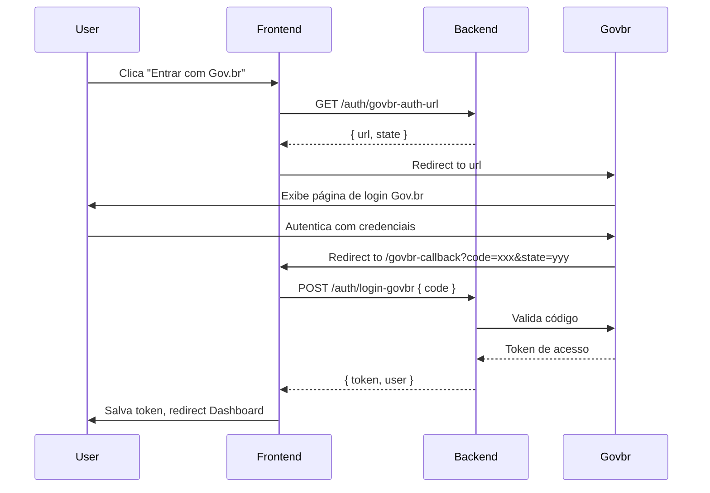

# Auth API Contracts

## Overview

Frontend integration with backend authentication endpoints for Gov.br OAuth2 flow.

## Endpoints

### GET /auth/govbr-auth-url

Retorna a URL de redirecionamento para autenticação Gov.br.

**Request**: None

**Response** (200 OK):
```json
{
  "url": "https://autenticacao.gov.br/...&redirect_uri=...",
  "state": "abc123-def456-ghi789"
}
```

**Errors**:
- 500: Erro interno ao gerar URL

---

### POST /auth/login-govbr

Troca código de autorização por token JWT.

**Request**:
```json
{
  "code": "authorization-code-from-govbr",
  "redirect_uri": "https://app.troca-aula.com/auth/govbr-callback"
}
```

**Response** (200 OK):
```json
{
  "token": "eyJhbGciOiJIUzI1NiIs...",
  "user": {
    "id": "user-123",
    "name": "João Silva",
    "email": "joao.silva@exemplo.gov.br",
    "cpf": "12345678901",
    "roles": ["teacher"]
  },
  "expires_in": 3600
}
```

**Errors**:
- 400: Código inválido ou expirado
- 401: Falha na autenticação Gov.br
- 500: Erro interno do servidor

---

## Sequence Diagram

