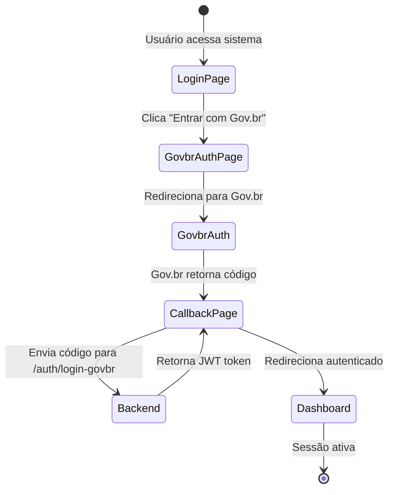
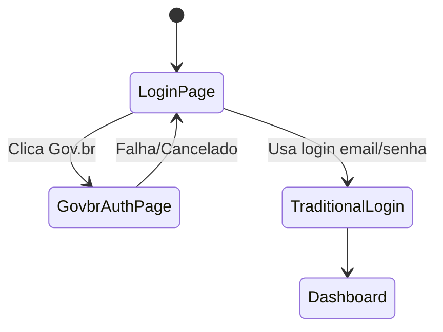

# Data Model: Gov.br OAuth2 Integration

## Entities

### GovbrAuthUrlResponse

Resposta do endpoint `/auth/govbr-auth-url` que retorna a URL de redirecionamento para autenticação Gov.br.

| Field | Type | Required | Description |
|-------|------|----------|-------------|
| url | string | Yes | URL completa para redirecionamento Gov.br |
| state | string | Yes | CSRF state token para validação de callback |

### GovbrLoginRequest

Request para endpoint `/auth/login-govbr` com o código de autorização.

| Field | Type | Required | Description |
|-------|------|----------|-------------|
| code | string | Yes | Código de autorização recebido do Gov.br |
| redirect_uri | string | Yes | URI de callback utilizada na autorização |

### GovbrLoginResponse

Resposta do endpoint `/auth/login-govbr` após troca de código por token.

| Field | Type | Required | Description |
|-------|------|----------|-------------|
| token | string | Yes | JWT token de autenticação |
| user | UserDTO | Yes | Dados do usuário autenticado |
| expires_in | number | Yes | Tempo de validade do token em segundos |

### UserDTO

Dados do usuário retornados após autenticação Gov.br.

| Field | Type | Required | Description |
|-------|------|----------|-------------|
| id | string | Yes | Identificador único do usuário |
| name | string | Yes | Nome completo do usuário |
| email | string | Yes | Email do usuário (do Gov.br) |
| cpf | string | Yes | CPF do usuário |
| roles | string[] | Yes | Perfis/roles do usuário |

## State Transitions

### Authentication Flow

### Error Flow

## Validation Rules

- **code**: String não vazia, formato UUID ou code Gov.br
- **redirect_uri**: URL válida cadastrada no Gov.br
- **token**: JWT válido, verificar expiração
- **user.cpf**: Formato CPF válido (11 dígitos)