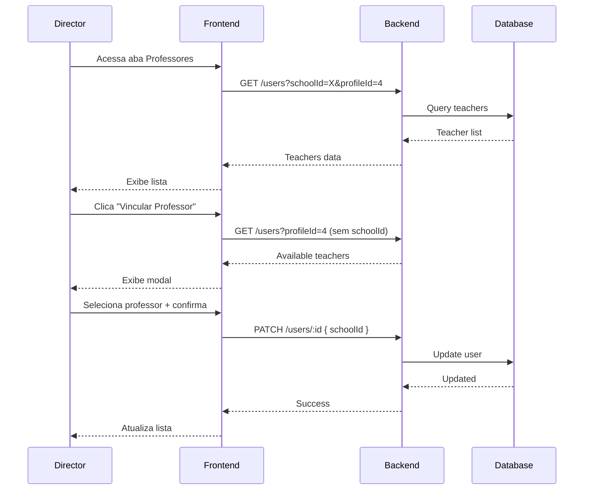
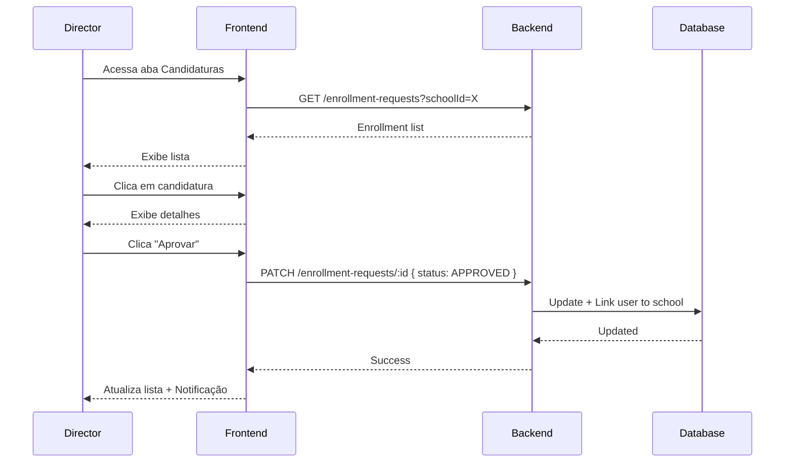

# Teacher Management API Contracts

## Overview

Frontend integration with backend for Director teacher management functionality.

## Endpoints

### GET /users

Lista professores (vinculados ou disponíveis).

**Query Parameters**:
- `schoolId` (optional): Filtrar por escola
- `profileId` (optional): Filtrar por perfil (4 = Professor)

**Request**: None

**Response** (200 OK):
```json
[
  {
    "id": "user-123",
    "name": "João Silva",
    "email": "joao@escola.com",
    "schoolId": "school-1",
    "profileId": 4,
    "subject": { "id": "subj-1", "name": "Matemática" },
    "totalSubstitutions": 15
  }
]
```

**Errors**:
- 401: Unauthorized
- 403: Forbidden (não é diretor)

---

### PATCH /users/:id

Atualiza vínculo do professor (vincular/desvincular).

**Request**:
```json
{
  "schoolId": "school-1"  // null para desvincular
}
```

**Response** (200 OK):
```json
{
  "id": "user-123",
  "name": "João Silva",
  "schoolId": "school-1",
  "profileId": 4
}
```

**Errors**:
- 400: Dados inválidos
- 404: Usuário não encontrado
- 403: Forbidden

---

### GET /enrollment-requests

Lista candidaturas da escola.

**Query Parameters**:
- `schoolId` (required): ID da escola
- `status` (optional): PENDING, APPROVED, REJECTED

**Request**: None

**Response** (200 OK):
```json
[
  {
    "id": "enr-123",
    "userId": "user-456",
    "schoolId": "school-1",
    "status": "PENDING",
    "appliedAt": "2026-05-17T10:00:00Z",
    "user": {
      "id": "user-456",
      "name": "Maria Santos",
      "email": "maria@email.com",
      "subject": { "id": "subj-2", "name": "Física" },
      "totalSubstitutions": 8
    }
  }
]
```

**Errors**:
- 400: Parâmetros inválidos
- 401: Unauthorized

---

### PATCH /enrollment-requests/:id

Aprova ou rejeita candidatura.

**Request**:
```json
{
  "status": "APPROVED"  // ou "REJECTED"
}
```

**Response** (200 OK):
```json
{
  "id": "enr-123",
  "userId": "user-456",
  "schoolId": "school-1",
  "status": "APPROVED",
  "appliedAt": "2026-05-17T10:00:00Z"
}
```

**Errors**:
- 400: Status inválido ou transição não permitida
- 404: Candidatura não encontrada

---

## Sequence Diagram: Link Teacher



---

## Sequence Diagram: Approve Enrollment

