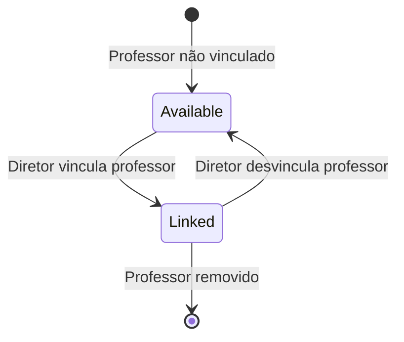
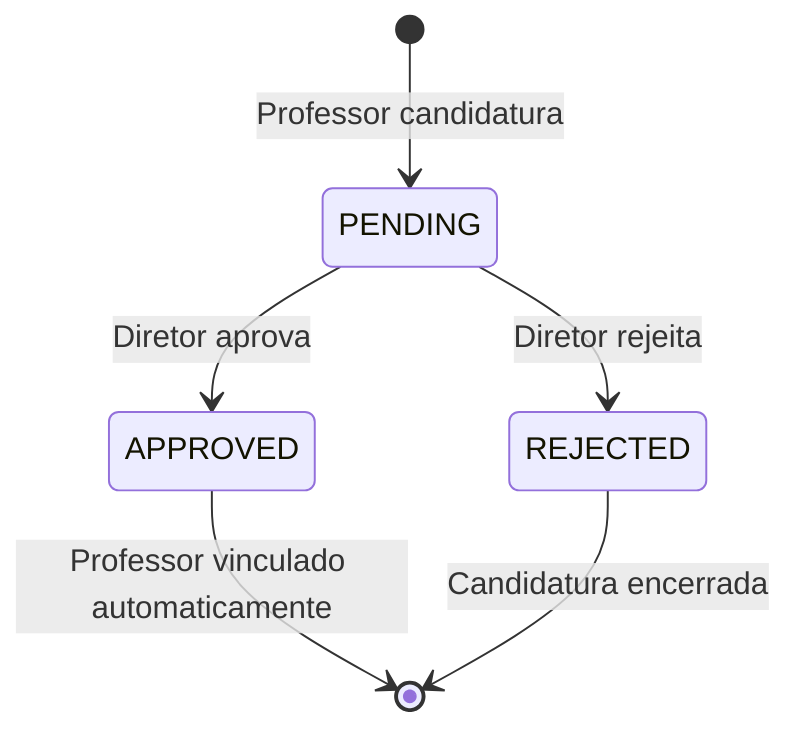

# Data Model: Director Teacher Management

## Entities

### Teacher (Professor Vinculado)

Entidade representando professor vinculado a uma escola.

| Field | Type | Required | Description |
|-------|------|----------|-------------|
| id | string | Yes | Identificador único do usuário |
| name | string | Yes | Nome completo do professor |
| email | string | Yes | Email do professor |
| schoolId | string | Yes | ID da escola vinculada |
| profileId | number | Yes | Perfil (4 = Professor) |
| subject | Subject | No | Disciplina que leciona |
| totalSubstitutions | number | Yes | Total de substituições realizadas |

### Subject

Disciplina lecionada pelo professor.

| Field | Type | Required | Description |
|-------|------|----------|-------------|
| id | string | Yes | Identificador único |
| name | string | Yes | Nome da disciplina |

### EnrollmentRequest (Candidatura)

Candidatura de professor a uma escola.

| Field | Type | Required | Description |
|-------|------|----------|-------------|
| id | string | Yes | Identificador único |
| userId | string | Yes | ID do professor candidato |
| schoolId | string | Yes | ID da escola |
| status | enum | Yes | PENDING, APPROVED, REJECTED |
| appliedAt | Date | Yes | Data da candidatura |
| user | TeacherCandidate | No | Dados do candidato |

### TeacherCandidate

Dados do candidato (para visualização na candidatura).

| Field | Type | Required | Description |
|-------|------|----------|-------------|
| id | string | Yes | Identificador |
| name | string | Yes | Nome completo |
| email | string | Yes | Email |
| subject | Subject | No | Disciplina |
| totalSubstitutions | number | Yes | Histórico de substituições |

## State Transitions

### Teacher Link Flow

### Enrollment Request Flow

## Validation Rules

- **schoolId**: Obrigatório para listagens, deve pertencer à escola do diretor logado
- **profileId**: Must be 4 (Professor) for teacher listing
- **status**: Must be PENDING, APPROVED, or REJECTED for enrollment requests
- **totalSubstitutions**: Calculado automaticamente, não pode ser modificado manualmente