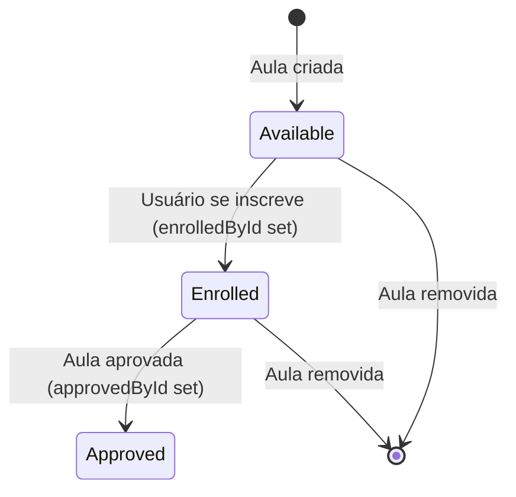

# Data Model: Fix Registry Nomenclature

## Entities

### Class (Aula)

Entidade que representa uma aula. O campo `enrolledById` indica qual usuário se inscreveu na aula. O campo `enrolledBy` contém os dados do usuário inscrito.

| Field | Type | Required | Description |
|-------|------|----------|-------------|
| id | number | Yes | Identificador único da aula |
| subject | Subject | Yes | Disciplina da aula |
| school | School | Yes | Escola onde ocorre a aula |
| statededAt | string | Yes | Data/hora de início |
| finishedAt | string | Yes | Data/hora de término |
| enrolledById | number \| null | No | ID do usuário inscrito na aula |
| enrolledBy | object \| null | No | Dados do usuário inscrito (name, etc.) |
| approvedById | number \| null | No | ID do usuário que aprovou a aula |

### State Transitions

### Renomeação de Campos

| Campo Antigo | Campo Novo | Motivo |
|--------------|------------|--------|
| `registredById` | `enrolledById` | Alinhar com nomenclatura da API |
| `registredBy` | `enrolledBy` | Alinhar com nomenclatura da API |
